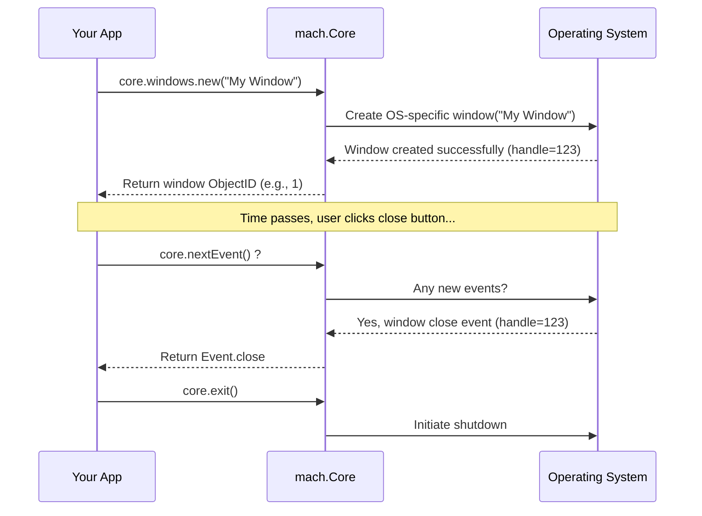

# Chapter 1: Mach Core (Windowing & Input)

> (`mach.Core`) — *Mach Engine 0.4*

> ***CAUTION**:* *THIS TUTORIAL WAS AI-GENERATED AND MAY CONTAIN ERRORS. IT IS **NOT** AFFILIATED WITH OR ENDORSED BY HEXOPS/MACH.*

Welcome to the Mach engine tutorial! We're excited to have you on board. Let's start our journey by looking at the very first thing you usually see and interact with in a graphical application or game: the window!

## The Stage for Your Application

Imagine you're directing a play. You need a stage, right? A place for your actors (graphics) to perform and for the audience (user) to see what's happening. You also need a way for the audience to react (like clapping, which is kind of like user input) and for the stage manager to coordinate everything – lights, curtains, scene changes.

In the world of computer graphics and games, `mach.Core` is like that essential stage manager. It handles:

1.  **Creating the Stage (Window):** It sets up the application window on the user's screen. It doesn't matter if the user is on Windows, macOS, or Linux; `mach.Core` figures out how to talk to the operating system (OS) to create that window.
2.  **Listening to the Audience (Input):** It listens for user actions like pressing keys on the keyboard, moving the mouse, or clicking mouse buttons.
3.  **Managing the Show (Event Loop):** It runs the main loop of your application, constantly checking for user input or window events (like resizing or closing) and telling your application what happened.
4.  **Setting the Scene (Window Properties):** It lets you control things like the window's title, size, and whether it's fullscreen.

Without `mach.Core`, your cool graphics wouldn't have a place to be shown, and you wouldn't be able to interact with your application!

## Key Concepts

Let's break down the main ideas within `mach.Core`:

*   **Window:** This is the rectangular area on your screen managed by the operating system where your application draws its visuals. `mach.Core` lets you create one or more of these.
*   **Input:** Actions performed by the user, primarily using the keyboard and mouse.
*   **Event:** A specific thing that happens, like `key_press`, `mouse_motion`, or the user clicking the close button (`close`). `mach.Core` collects these events.
*   **Event Loop:** The heart of a real-time application. It's a continuous cycle that does roughly this:
    1.  Check for any new events (input, window changes).
    2.  Process those events (run your code to react to them).
    3.  Update the application state (move characters, calculate physics).
    4.  Draw the next frame.
    5.  Repeat!

`mach.Core` manages this loop and provides the events to your application code.

## Putting `mach.Core` to Work

Let's see how you actually use `mach.Core`. In the "Getting Started" guide, you saw a basic `App.zig` file.

**1. Including `mach.Core`**

First, you need to tell your Mach application that you intend to use the Core module. This is done by adding `mach.Core` to the `Modules` list in your `App.zig`:

```zig
// src/App.zig (Simplified)
const mach = @import("mach");

// ... other App struct details ...

// Tell Mach we want to use the Core module and our own App module.
pub const Modules = mach.Modules(.{
    mach.Core, // <-- Here it is!
    App,
});

// ... rest of the App code ...
```

This line registers `mach.Core` with the engine, making its features available to your application.

**2. Creating a Window**

Inside your `init` function (which runs once at the start), you can ask `mach.Core` to create a window:

```zig
// src/App.zig (Inside the init function)

pub fn init(
    core: *mach.Core, // Mach gives us access to the Core module
    app: *App,
    app_mod: mach.Mod(App),
) !void {
    // Tell the Core what function to call every frame (tick)
    core.on_tick = app_mod.id.tick;
    // Tell the Core what function to call when exiting
    core.on_exit = app_mod.id.deinit;

    // Ask core to create a new window with a title
    const window = try core.windows.new(.{
        .title = "My First Mach Window!",
    });

    // Store the window's ID so we can refer to it later
    app.window = window;

    // ... other setup ...
}
```

*   We get a `core: *mach.Core` parameter, giving us access to the Core module's functions.
*   `core.windows.new(...)` is the command to create a new window. We pass options like the `.title`.
*   This returns a `window` identifier, which is an `ObjectID`. We'll learn more about `ObjectID`s in [Chapter 2: Mach Object System](02_mach_object_system_.md). For now, just think of it as a unique name or handle for our window.

**3. Handling Events in the Loop**

The `tick` function is called repeatedly, once for each frame (or update cycle). Inside `tick`, we need to check for and handle any events that `mach.Core` has collected since the last tick.

```zig
// src/App.zig (Inside the tick function)

pub fn tick(app: *App, core: *mach.Core) void {
    // Check for events until there are no more left for this tick
    while (core.nextEvent()) |event| {
        // Figure out what kind of event it is
        switch (event) {
            // If the user clicked the close button...
            .close => {
                std.log.info("Close button clicked! Exiting.", .{});
                core.exit(); // Tell the core to stop the application
            },
            // If a key was pressed...
            .key_press => |ev| {
                std.log.info("Key pressed: {any}", .{ev.key});
            },
            // If the mouse moved...
            .mouse_motion => |ev| {
                std.log.info("Mouse moved to: ({d:.1}, {d:.1})", .{ev.pos.x, ev.pos.y});
            },
            // We can ignore other events for now
            else => {},
        }
    }

    // ... rest of the tick logic (like drawing) ...
}
```

*   `core.nextEvent()` retrieves the oldest unhandled event. The `while` loop continues as long as there are events waiting.
*   The `switch` statement lets us react differently based on the `event` type (e.g., `.close`, `.key_press`, `.mouse_motion`).
*   `core.exit()` tells `mach.Core` to begin the shutdown process.

This event loop is fundamental. It's how your application stays responsive to the user and the windowing system.

**4. Checking Input State Directly**

Sometimes, instead of waiting for an event, you want to know the *current* state of a key or mouse button (e.g., "Is the 'W' key held down right now?"). `mach.Core` provides functions for this too:

```zig
// src/App.zig (Inside the tick function, after the event loop)

    // Check if the spacebar is currently pressed down
    if (core.keyPressed(.space)) {
        std.log.debug("Spacebar is held down!", .{});
        // Maybe make the character jump!
    }

    // Get the current mouse position
    const mouse_pos = core.mousePosition();
    // std.log.debug("Current mouse position: {any}", .{mouse_pos});

    // ... rest of tick ...
```

These functions (`keyPressed`, `mousePosition`, etc.) give you a snapshot of the input state at the exact moment you call them.

## Under the Hood: How `mach.Core` Works

It seems simple to create a window and get input, but `mach.Core` is doing a lot of work behind the scenes!

**High-Level Idea:**

`mach.Core` acts as a translator between your Mach application code (which is the same for all platforms) and the specific way each operating system handles windows and input.

*   When you call `core.windows.new()`, `mach.Core` figures out if you're on Windows, macOS, or Linux.
*   It then calls the specific OS functions needed to create a window (e.g., using Win32 API on Windows, Cocoa on macOS, X11 or Wayland on Linux).
*   Similarly, during the event loop (`core.nextEvent()`), `mach.Core` asks the OS if any new input or window events have happened.
*   It translates these OS-specific events into the standard `mach.Core.Event` format that your application understands.

This abstraction layer means you don't have to worry about the low-level details of each platform!

**A Simple Sequence:**

Here's a simplified view of what happens when you create a window and handle a close event:



**Code Glance:**

*   **`src/Core.zig`:** This is the main file for `mach.Core`.
    *   It defines the `Core` struct itself, holding state like the event queue.
    *   It defines the `Event` union and related input types (`Key`, `MouseButton`, `Position`, etc.).
    *   It contains the cross-platform logic like `nextEvent()` and `exit()`.
    *   It defines `windows: mach.Objects(...)` which uses the [Mach Object System](02_mach_object_system_.md) to manage data for each window.

    ```zig
    // src/Core.zig (Simplified Snippet)
    pub const Core = @This();

    // Manages all the windows created by the application
    windows: mach.Objects(
        // ... options ...
        struct { // Data stored per window
            title: [:0]const u8 = "Mach Window",
            width: u32 = 960,
            height: u32 = 540,
            // ... other window properties ...
            native: ?Platform.Native = null, // OS-specific data
        },
    ),

    // Queue for storing events received from the OS
    events: EventQueue,
    // ... other Core state ...

    // Returns the next event from the queue
    pub inline fn nextEvent(core: *@This()) ?Event {
        return core.events.readItem();
    }
    ```

*   **`src/core/Windows.zig`, `src/core/Darwin.zig`, `src/core/Linux.zig`:** These files contain the platform-specific implementation details. `Core.zig` calls functions within these files (like `Platform.tick()` or `Platform.initWindow()`) to interact with the underlying OS. You generally don't need to look into these unless you're contributing to the engine itself.

## Conclusion

You've learned about `mach.Core`, the fundamental module in Mach for creating windows and handling user input. It acts as your application's stage manager, providing a consistent way to interact with the user and display graphics, regardless of the operating system. You saw how to include it in your app, create a window, process events in the `tick` loop, and check input state directly.

`mach.Core` manages windows as *objects*. To understand how Mach represents and manages data like windows, cameras, or game entities, we need to dive into the Mach Object System.

Let's move on to [Chapter 2: Mach Object System](02_mach_object_system_.md).

---

Generated by [AI Codebase Knowledge Builder](https://github.com/mnbnkr/Tutorial-Codebase-Knowledge)
