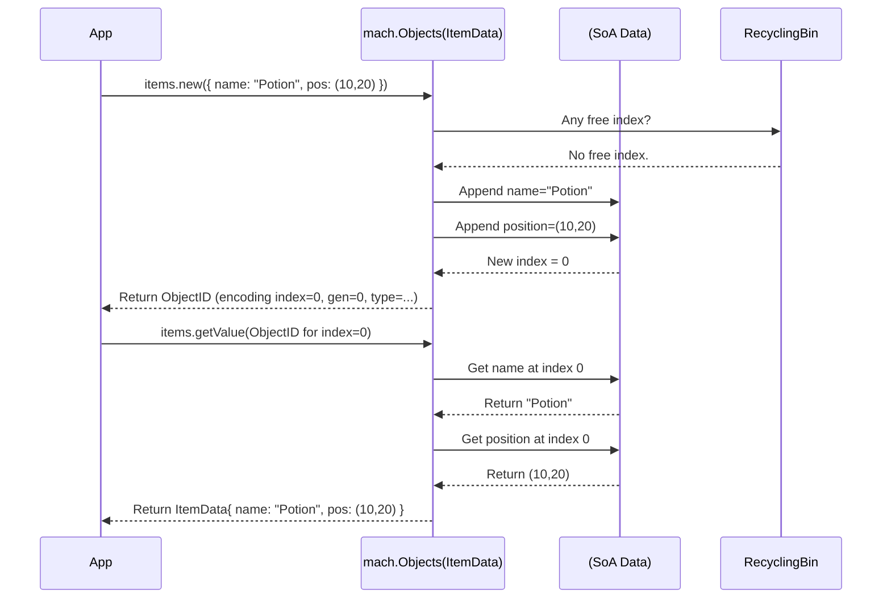

# Chapter 2: Mach Object System

> (`mach.Objects`, `ObjectID`) — *Mach Engine 0.4*

> ***CAUTION**:* *THIS TUTORIAL WAS AI-GENERATED AND MAY CONTAIN ERRORS. IT IS **NOT** AFFILIATED WITH OR ENDORSED BY HEXOPS/MACH.*

In [Chapter 1: Mach Core: Essentials](01_mach_core_.md), we saw how `mach.Core` manages essential tasks like creating windows and handling input. We even saw a hint of how it manages window data using `core.windows`, which is actually an instance of `mach.Objects`. Now, let's dive into how Mach organizes and manages *all sorts* of data in your application or game.

## Why a Special System for Data?

Imagine you're making a game with hundreds of monsters. Each monster needs data: health points, position on the screen, maybe attack power. How do you store and manage all this information efficiently?

You could use standard lists or arrays of monster structs. However, when dealing with potentially thousands of objects, accessing and processing this data quickly becomes crucial for performance. Game engines often use specialized systems for this.

Mach provides the **Mach Object System**, centered around `mach.Objects`. It's designed to be:

1.  **Fast:** It arranges data in memory in a way that CPUs love (called Struct-of-Arrays), making operations on many objects very quick.
2.  **Organized:** It provides a clear way to group related data together.
3.  **Flexible:** It allows relating objects to each other, even if they are in different groups.

Think of `mach.Objects` as a highly optimized spreadsheet or database table built specifically for game engine data. Instead of rows representing objects and columns representing data fields (like in a typical spreadsheet), `mach.Objects` stores all values for a *single field* together in memory.

## Key Concepts

Let's break down the core ideas:

*   **`mach.Objects(DataType)`:** This is the container, the "spreadsheet." You define it to hold objects of a specific `struct` type (the `DataType`). For example, you might have `monsters: mach.Objects(MonsterData)` or, as we saw in Chapter 1, `windows: mach.Objects(WindowData)`. It manages a collection of these structs.
*   **Struct-of-Arrays (SoA):** This is the *secret sauce* for performance. Instead of storing data like `[Monster1(HP, Pos), Monster2(HP, Pos), Monster3(HP, Pos)]`, `mach.Objects` stores it like `[HP1, HP2, HP3]` and `[Pos1, Pos2, Pos3]` separately. When your code needs to update *all* monster positions, it can access them contiguously in memory, which is much faster for the CPU cache.
*   **`ObjectID`:** When you add a new object (like a new monster) to a `mach.Objects` list, you don't get a direct pointer. Instead, you get an `ObjectID`. This is a unique, stable number (an opaque `u64`) that acts as a *handle* or *identifier* for that specific object within that list. You use this ID to get, set, or delete the object's data later. Even if objects are deleted and their memory slots reused, the `ObjectID` helps detect if you're accidentally trying to use an old, invalid handle (detecting "use-after-delete").
*   **Object Relations:** Mach allows you to create connections (like parent-child relationships) between objects, even if they live in different `mach.Objects` lists. For instance, you could link a `Sprite` object to a `Player` object. ([Object system: relations](../object/relations.md))

## Putting `mach.Objects` to Work

Let's make a simple list to manage some game items, each having a position and a name.

**1. Declaring `mach.Objects`**

First, we declare a field in our `App` struct (or any Mach module) using `mach.Objects`. We specify the struct type it will hold.

```zig
// src/App.zig (Simplified)
const mach = @import("mach");
const math = mach.math; // We'll use Mach's math library

const ItemData = struct {
    name: [*:0]const u8, // A name (C-style string)
    position: math.Vec2, // A 2D vector for position
};

const App = @This();

pub const Modules = mach.Modules(.{
    mach.Core, // We still need Core for windowing/events
    App,
});

// Our list of items!
items: mach.Objects(ItemData),

// ... rest of App struct (init, tick, etc.) ...
```

*   We define `ItemData` to hold the data for each item.
*   We declare `items: mach.Objects(ItemData)` as a field in our `App`. Mach automatically initializes this for us.

**2. Creating Objects (`.new()`)**

Inside our `init` function, let's create a couple of items.

```zig
// src/App.zig (Inside init function)
pub fn init(
    core: *mach.Core,
    app: *App,
    app_mod: mach.Mod(App),
) !void {
    // ... other setup like core.on_tick ...

    std.log.info("Creating items...", .{});

    // Create a 'potion' item
    const potion_id = try app.items.new(.{
        .name = "Potion",
        .position = math.vec2(10.0, 20.0),
    });

    // Create a 'sword' item
    const sword_id = try app.items.new(.{
        .name = "Sword",
        .position = math.vec2(-5.0, 15.0),
    });

    std.log.info("Created Potion with ID: {any}", .{potion_id});
    std.log.info("Created Sword with ID: {any}", .{sword_id});

    // We could store these IDs in 'app' if we need them later
    // app.potion = potion_id;
    // app.sword = sword_id;
}
```

*   `app.items.new(...)` adds a new `ItemData` struct to the `items` list.
*   It returns an `ObjectID` (like `potion_id`, `sword_id`), which uniquely identifies the newly created item within the `items` list.

**3. Accessing and Modifying Objects (`.getValue()`, `.setValue()`)**

Now, let's say in our `tick` function, we want to read the potion's data and maybe move the sword. We use the `ObjectID`s we saved (or would have saved).

```zig
// src/App.zig (Inside tick function)
pub fn tick(app: *App, core: *mach.Core) void {
    // ... event loop ...

    // Let's imagine we stored the IDs from init
    const potion_id: mach.ObjectID = 0; // Replace with actual stored ID
    const sword_id: mach.ObjectID = 1; // Replace with actual stored ID

    // ---- IMPORTANT: Locking ----
    // Before accessing data, we should lock the list to prevent issues
    // if other parts of the code (e.g., different threads) try to access it
    // simultaneously. `defer` ensures unlock is called even if we exit early.
    app.items.lock();
    defer app.items.unlock();
    // --------------------------

    // Get the current data for the potion
    const potion_data = app.items.getValue(potion_id);
    std.log.debug("Potion is at: {any}", .{potion_data.position});

    // Get the sword data, modify it, and save it back
    var sword_data = app.items.getValue(sword_id);
    sword_data.position.x += 0.1; // Move the sword slightly right
    app.items.setValue(sword_id, sword_data); // Save the changes

    // std.log.debug("Sword moved to: {any}", .{sword_data.position});

    // ... rest of tick ...
}
```

*   **Locking:** `app.items.lock()` and `defer app.items.unlock()` are crucial for safety, especially in multi-threaded scenarios. They ensure only one part of the code modifies the list at a time. For now, just know it's good practice when reading *and* writing.
*   `app.items.getValue(object_id)` retrieves a *copy* of the struct data associated with that `ObjectID`.
*   `app.items.setValue(object_id, new_data)` updates the object's data in the list with the `new_data` struct.
*   You can also get/set individual fields using `.get(id, .field_name)` and `.set(id, .field_name, value)`.

**4. Iterating Objects (`.slice()`)**

Often, you want to process *all* objects in a list. `mach.Objects` makes this efficient.

```zig
// src/App.zig (Inside tick function, after modifying sword)

    std.log.debug("Processing all items:", .{});
    var item_slice = app.items.slice(); // Get an iterator
    while (item_slice.next()) |item_id| {
        // Get the data for the current item_id in the loop
        const item_data = app.items.getValue(item_id);
        std.log.debug(" - Item '{s}' at {any}", .{item_data.name, item_data.position});

        // We could modify items here too:
        // var data = app.items.getValue(item_id);
        // data.position.y -= 0.01; // Move item up slightly
        // app.items.setValue(item_id, data);
    }
```

*   `app.items.slice()` creates an iterator (`Slice`) for the object list.
*   `while (item_slice.next()) |item_id|` loops through all *active* objects, giving you the `ObjectID` for each one.
*   Inside the loop, you use the `item_id` with `getValue` or `setValue` as needed.
*   This is very efficient because under the hood, iterating often involves walking through the tightly packed SoA arrays.

## Under the Hood: The Spreadsheet Analogy

How does `mach.Objects` achieve this?

**High-Level Idea:**

Instead of storing structs one after another like `[Item1][Item2][Item3]`, `mach.Objects` stores them column by column (Struct-of-Arrays):

*   `names: ["Potion", "Sword", ...]`
*   `positions: [Vec2(10, 20), Vec2(-5, 15), ...]`

When you ask for `items.getValue(sword_id)`, Mach:
1.  Uses the `ObjectID` to find the correct *index* (row number) for the sword.
2.  Pulls the `name` from the `names` array at that index.
3.  Pulls the `position` from the `positions` array at that index.
4.  Constructs the `ItemData` struct and returns it to you.

This grouping by field (`name`, `position`) dramatically improves performance when processing many objects, as the CPU can load chunks of related data (like many positions) very efficiently.

It also uses a "recycling bin" to keep track of deleted object slots, making creating (`.new()`) and deleting (`.delete()`) objects very fast as it avoids memory allocation/deallocation overhead most of the time.

**Sequence Diagram (Creating and Getting an Object):**



**Code Glance:**

The magic happens within Mach's internal code, primarily in `src/module.zig`.

*   **`src/module.zig`:** Defines the `Objects` function that creates the specialized list type and the `ObjectID` type.

    ```zig
    // src/module.zig (Highly Simplified Snippet)

    // Definition of the opaque ObjectID
    pub const ObjectID = u64;

    // Function that defines the Objects type
    pub fn Objects(options: ObjectsOptions, comptime T: type) type {
        return struct {
            // Internal state (simplified)
            internal: struct {
                allocator: std.mem.Allocator,
                mu: std.Thread.Mutex = .{}, // For locking
                type_id: u16, // Internal ID for this list type

                // The core data store! Holds data SoA style.
                data: std.MultiArrayList(T) = .{},

                // Tracks deleted slots
                dead: std.bit_set.DynamicBitSetUnmanaged = .{},
                // Tracks generation for use-after-delete detection
                generation: std.ArrayListUnmanaged(u16) = .{},
                // Stores reusable indices
                recycling_bin: std.ArrayListUnmanaged(u32) = .{},
                // ... other internal fields ...
            },

            // Public functions like .new(), .getValue(), .setValue(), .slice()
            // operate on the 'internal' state.

            pub fn new(objs: *@This(), value: T) !ObjectID {
                // 1. Lock the mutex
                // 2. Try to get an index from recycling_bin
                // 3. If none, append to 'data' (MultiArrayList)
                // 4. Update 'generation', clear 'dead' flag
                // 5. Construct and return ObjectID (packed index, gen, type_id)
                // 6. Unlock mutex
                // ... (Simplified logic) ...
            }

            pub fn getValue(objs: *@This(), id: ObjectID) T {
                // 1. Lock the mutex
                // 2. Unpack ID to get index, generation, type_id
                // 3. Validate ID (correct type? correct generation? not dead?)
                // 4. Get data from 'data' (MultiArrayList) at index
                // 5. Return data
                // 6. Unlock mutex
                // ... (Simplified logic) ...
            }

            // ... other functions (.setValue, .delete, .slice, .lock, .unlock) ...
        };
    }
    ```

*   `std.MultiArrayList(T)`: This Zig standard library type is the key component that actually implements the Struct-of-Arrays layout. `mach.Objects` builds upon it, adding features like `ObjectID`s, recycling, locking, and relations.

## Conclusion

You've learned about the Mach Object System, Mach's efficient way to manage collections of data using `mach.Objects`. You saw how it uses a Struct-of-Arrays (SoA) layout for performance, how objects are identified and accessed using opaque `ObjectID`s, and how to perform basic operations like creating, accessing, modifying, and iterating over objects. We also touched on the importance of locking for data safety.

This system is fundamental to how Mach organizes everything from windows (`mach.Core.windows`) to graphics resources ([`mach.gfx`](05_mach_gfx_.md)) and your own game entities.

Now that we know how to store and manage data, how do we write the code that *operates* on this data each frame? That's where Mach Systems come in.

Let's move on to [Chapter 3: Mach Systems](03_mach_systems_.md).

---

Generated by [AI Codebase Knowledge Builder](https://github.com/mnbnkr/Tutorial-Codebase-Knowledge)
