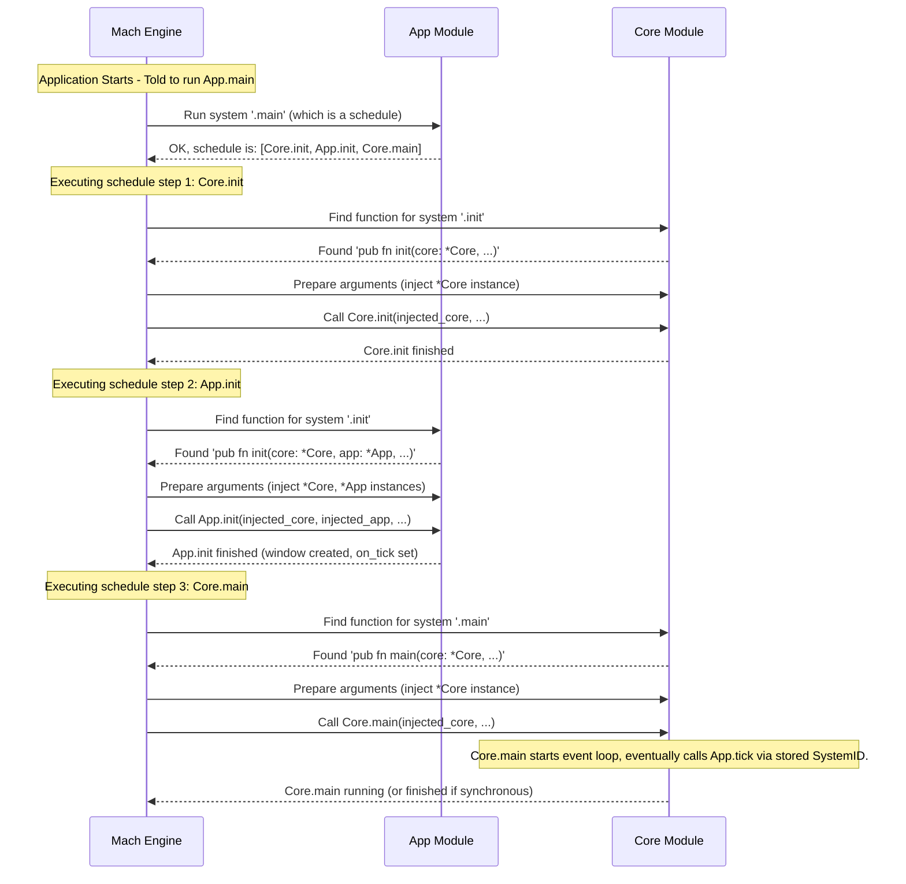

# Chapter 3: Mach Systems

> (`mach_systems`, `mach.schedule`) — *Mach Engine 0.4*

> ***CAUTION**:* *THIS TUTORIAL WAS AI-GENERATED AND MAY CONTAIN ERRORS. IT IS **NOT** AFFILIATED WITH OR ENDORSED BY HEXOPS/MACH.*

In [Chapter 2: Mach Object System](02_mach_object_system_.md), we learned how Mach efficiently stores and manages data using `mach.Objects` and `ObjectID`s. We saw how modules can hold lists of data, like our `items` list in the `App` module.

But data just sitting there isn't very interesting! We need a way to *do things* with that data – move items, check for collisions, update scores, draw graphics. How do we define the actions and control when they happen? That's where **Mach Systems** come in.

## Giving Your Application Actions (Verbs)

Think about the data we manage (like items, windows, players) as the **nouns** in our application. Systems are the **verbs** – the actions that operate on these nouns.

*   **Noun:** `ItemData` (managed by `mach.Objects`)
*   **Verb (System):** `move_item`, `check_item_collision`, `draw_item`

We need a way to:

1.  **Define these actions:** Write functions that contain the logic (e.g., the code to update an item's position).
2.  **Tell Mach about them:** Register these functions so the engine knows they exist and can potentially run them.
3.  **Control the flow:** Specify the order in which actions should happen, especially during initialization or each frame (tick).

Mach provides `mach_systems` and `mach.schedule` to handle exactly this.

## Key Concepts

*   **System:** A regular Zig function defined within a Mach module that encapsulates a specific piece of logic or action. Examples: `init`, `tick`, `move_player`, `render_graphics`.
*   **`mach_systems`:** A special `pub const` declaration inside a module. It's a list of names (like `.init`, `.tick`) that tells Mach, "These public functions in my module are systems that you can potentially run."
*   **Dependency Injection:** Systems can declare parameters for other modules they need access to (e.g., `app: *App`, `core: *mach.Core`). When Mach runs the system, it automatically "injects" or provides these modules as arguments. You don't need to pass them manually!
*   **`mach.schedule`:** A way to define a named, ordered sequence of systems to run. You can list systems from *different* modules. Think of it as a script or a checklist telling Mach, "Run this system, then that system, then this other one."

## Putting Systems and Schedules to Work

Let's look back at the `App.zig` example from "Getting Started" and see how systems are used.

**1. Declaring Systems (`mach_systems`)**

In `App.zig`, we see this line:

```zig
// src/App.zig (Near the top)
pub const mach_module = .app; // Module name from Chapter 4

// Tell Mach about the functions in this module that are systems
pub const mach_systems = .{ .main, .init, .tick, .deinit };
```

*   This line tells Mach that the `App` module has four systems named `main`, `init`, `tick`, and `deinit`.
*   Mach expects to find `pub fn init(...)`, `pub fn tick(...)`, `pub fn deinit(...)`, and `pub const main = mach.schedule(...)` defined within this `App.zig` file.

**2. Writing a System Function (`tick`)**

The `tick` function is a perfect example of a system:

```zig
// src/App.zig (tick system function)

// This function is a system because '.tick' is listed in mach_systems
pub fn tick(
    app: *App,       // Asks for the App module's state
    core: *mach.Core // Asks for the Core module's state
) void {
    // Process events (using 'core')
    while (core.nextEvent()) |event| {
        // ... event handling logic ...
        switch (event) {
            .close => core.exit(), // Use 'core' to exit
            // ... other cases ...
            else => {},
        }
    }

    // Get window data (using 'core')
    const window = core.windows.getValue(app.window); // Uses 'app' state

    // ... drawing logic using 'window' and 'app.pipeline' ...

    // Example: Accessing app state directly
    std.log.debug("Tick running! Pipeline: {any}", .{app.pipeline});
}
```

*   This is just a normal Zig function.
*   Crucially, it takes `app: *App` and `core: *mach.Core` as parameters. This is **dependency injection**. We didn't have to manually pass these in when `tick` is called; Mach handles it because `.tick` is registered as a system.
*   Inside the function, we can now use `app` to access the `App` module's data (like `app.window` or `app.pipeline`) and `core` to access `mach.Core`'s functions and data (like `core.nextEvent()`, `core.exit()`, `core.windows`).

**3. Defining Execution Order (`mach.schedule`)**

How does the application start? How does `init` get called before the main loop begins? The `main` system, defined using `mach.schedule`, controls this:

```zig
// src/App.zig (main schedule definition)

// '.main' is listed in mach_systems, so this schedule is a system.
pub const main = mach.schedule(.{
    // Step 1: Run the '.init' system from the 'mach.Core' module
    .{ mach.Core, .init },

    // Step 2: Run the '.init' system from *this* module ('App')
    .{ App, .init },

    // Step 3: Run the '.main' system from the 'mach.Core' module
    // (This likely starts the main event loop in Core)
    .{ mach.Core, .main },
});
```

*   `mach.schedule` creates a system that is simply a list of other systems to run *in order*.
*   Each item `.{ ModuleType, .system_name }` specifies which system to run from which module.
*   When the application starts, Mach is typically configured to run the `.main` system of your primary application module (like `App`).
*   So, this schedule dictates the startup sequence:
    1.  `mach.Core` initializes itself (`mach.Core.init`).
    2.  Our `App` initializes itself (`App.init`), creating the window and pipeline.
    3.  `mach.Core` starts its main loop (`mach.Core.main`), which will eventually start calling our `App.tick` function repeatedly (because we set `core.on_tick = app_mod.id.tick` inside `App.init`).

**4. Running Systems (Implicitly and Explicitly)**

*   **Implicitly via Callbacks:** As seen above, `mach.Core`'s main loop calls our `App.tick` because we registered it using `core.on_tick = app_mod.id.tick;`. This uses a `SystemID` (a unique identifier for a system) which we get via `app_mod.id.tick`. `app_mod` is another injected parameter (`app_mod: mach.Mod(App)`), providing ways to interact with the module system itself.
*   **Explicitly via Schedules:** The `main` schedule explicitly runs `Core.init`, `App.init`, and `Core.main`.
*   **Explicitly via `mod.run()`:** You can also directly run a system if you have the module's `mach.Mod(T)` handle. For example, inside a system:

    ```zig
    pub fn some_system(app_mod: mach.Mod(App), app: *App) void {
        std.log.info("Running some_system...", .{});

        // Maybe perform some logic...

        // Explicitly run the 'deinit' system on the App module
        // (This is just an example, usually deinit runs at the end)
        // app_mod.run(app_mod.id.deinit); // Requires getting the ID first

        // Easier way using compile-time known system name:
        app_mod.call(.deinit);
        std.log.info("Called app.deinit explicitly.", .{});
    }
    ```
    (Note: Calling `deinit` like this is unusual, it's just for illustration).

## Under the Hood: Orchestrating the Actions

How does Mach manage to call these functions and provide the right arguments?

**High-Level Idea:**

1.  **Registration:** When your application starts, Mach processes all the modules you listed (like `mach.Core` and `App`). It reads their `mach_systems` lists to build an internal registry of all available systems and which module they belong to.
2.  **Scheduling:** When a schedule (like `App.main`) is run, Mach looks up each system listed in the schedule in its registry.
3.  **Execution & Injection:** For each system to be run, Mach inspects the required parameters of the corresponding function. It then finds the necessary module instances (like the global instance of `mach.Core` or `App`) and passes them as arguments when calling the function.
4.  **Callbacks:** When you set something like `core.on_tick = app_mod.id.tick`, you're storing the unique ID of the `App.tick` system. Later, when `mach.Core` needs to trigger the tick, it uses this ID to look up and run the correct system, again performing dependency injection.

**Sequence Diagram (Running the `App.main` Schedule):**



**Code Glance:**

The core logic for handling modules, systems, and schedules resides primarily in `src/module.zig`.

*   **`src/module.zig`:**
    *   Defines `mach.Modules(...)`, which processes the list of modules provided by your application.
    *   Defines `mach.Mod(T)`, the handle type (like `app_mod`) that provides functions like `.call()` and access to system IDs (`.id`).
    *   Contains the internal logic for looking up systems by name or ID (`callDynamic`), inspecting function signatures for dependency injection, and executing functions or schedules.
    *   Likely implements `mach.schedule` by creating a structure that holds the list of system steps.

    ```zig
    // src/module.zig (Conceptual Snippet)

    // Function to get the module handle
    pub fn get(m: *@This(), module_tag_or_type: anytype) Module(module_tag_or_type) {
        // ... returns the Module handle struct ...
    }

    // The Module handle struct definition (simplified)
    pub fn Module(module_tag_or_type: anytype) type {
        // ... type definition ...
        return struct {
            // ... other fields ...

            // Function to run a system known at compile-time
            pub fn run(
                m: *const @This(),
                comptime fn_name: ModuleFunctionName(module_name),
            ) void {
                // 1. Find the actual function/schedule for fn_name
                // 2. If it's a schedule:
                //    Iterate through schedule steps and recursively call run() for each step.
                // 3. If it's a function:
                //    a. Inspect function parameters using @typeInfo
                //    b. For each parameter (*Module or Mod(Module)):
                //       Look up the required module instance from internal state.
                //    c. Prepare the arguments tuple.
                //    d. Call the function using @call with the prepared arguments.
            }
        };
    }

    // Function to run a system known only at runtime via its ID
    pub fn callDynamic(m: *@This(), f: FunctionID) void {
        // 1. Use f.module_id and f.fn_id to find the module and system name.
        // 2. Call the appropriate Module(M).run(system_name) function.
    }

    // The mach.schedule function likely just returns a tuple or struct
    // that the run() function knows how to interpret.
    pub fn schedule(steps: anytype) @TypeOf(steps) {
        // Validate steps format...
        return steps; // Schedule is just the data describing the steps
    }
    ```

This system allows modules to declare their capabilities (systems) without needing to know exactly *when* or *how* they will be called. Schedules and callbacks then orchestrate the overall flow of the application.

## Conclusion

You've learned about Mach Systems, the "verbs" of your application that perform actions. We saw how modules declare their systems using `mach_systems`, how system functions get access to other modules via **dependency injection**, and how `mach.schedule` defines an ordered execution flow, like a script for your application's startup or main loop.

Systems operate on the data managed by the [Mach Object System](02_mach_object_system_.md). Together, objects (nouns) and systems (verbs) form the core of how you structure logic within individual pieces of your application. But how do we group these pieces together? That's the role of Mach Modules.

Let's move on to [Chapter 4: Mach Modules](04_mach_modules_.md) to see how these concepts fit into the bigger picture of application structure.

---

Generated by [AI Codebase Knowledge Builder](https://github.com/mnbnkr/Tutorial-Codebase-Knowledge)
