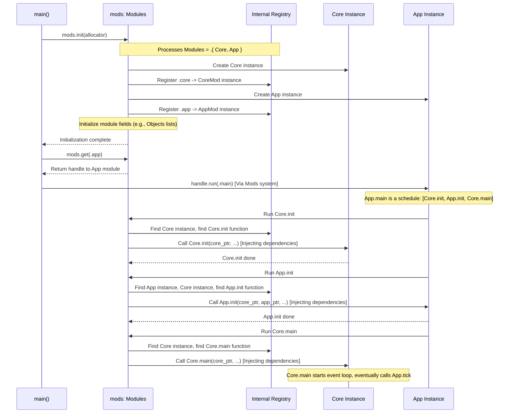

# Chapter 4: Mach Modules

> (`mach.Modules`) — *Mach Engine 0.4*

> ***CAUTION**:* *THIS TUTORIAL WAS AI-GENERATED AND MAY CONTAIN ERRORS. IT IS **NOT** AFFILIATED WITH OR ENDORSED BY HEXOPS/MACH.*

In [Chapter 3: Mach Systems](03_mach_systems_.md), we saw how to define actions (systems) and control their execution order. We also saw how systems can access data and functions from different parts of our application, like how our `App.tick` system used `core: *mach.Core`.

But how do we package these related pieces of data ([Chapter 2: Mach Object System](02_mach_object_system_.md)) and logic (systems) together in a structured way? How does Mach even know that our `App` and `mach.Core` exist and can talk to each other?

This is where **Mach Modules** come in!

## Building with LEGO Bricks

Imagine building something cool with LEGOs. You have different types of bricks: basic blocks, wheels, windows, maybe special engine parts. You pick the bricks you need for your creation and snap them together.

Mach Modules are like those LEGO bricks. They are the fundamental building blocks for organizing your Mach application.

*   **Each module is a self-contained unit:** It can hold its own data (state variables), its own lists of objects (`mach.Objects`), and its own actions (systems).
*   **You choose the modules you need:** Your application declares which modules it wants to use. Maybe you need `mach.Core` for the window, your own `App` module for the main logic, and later, a `Renderer` module for drawing complex scenes.
*   **Mach connects them:** Based on the list of modules you provide, Mach understands how they can interact, allowing systems in one module to use resources from another (like our `App.tick` using `core.nextEvent()`).

Modules help keep your code organized, making it easier to manage and reuse parts. You only include the "bricks" you actually need for your specific application.

## Key Concepts

Let's break down the main ideas:

*   **Module:** In Mach, a module is typically a Zig file (like `App.zig` or `Core.zig`) that defines a `struct`. This struct acts as a container.
    *   It **must** declare a unique name (e.g., `pub const mach_module = .app;`). No two modules in your final application can have the same name.
    *   It can contain **state** (variables specific to that module, like `window: mach.ObjectID` in our `App`).
    *   It can contain **objects** (lists managed by `mach.Objects`, like `core.windows` or `app.items`).
    *   It can declare **systems** (functions or schedules like `init`, `tick`, `main` listed in `mach_systems`).
*   **`mach.Modules(...)`:** This is a special declaration, usually at the top level of your application setup (either in your `App.zig` if using the standard template, or in a custom `main.zig`). It's a tuple listing *all* the module *types* that your application might use. Think of it as the master list of LEGO bricks available for building.
*   **Modularity:** Because applications are built by composing modules, you can easily swap parts out or only use the engine features you require. If your app doesn't need audio, you don't include the audio module!

## Putting Modules to Work

We've actually been using modules all along! Let's look at the `Getting Started` example code again.

**1. Defining a Module (`App.zig`)**

Our `src/App.zig` file *is* a Mach module.

```zig
// src/App.zig (Snippets)
const mach = @import("mach");
const gpu = mach.gpu;

// This defines the App struct itself
const App = @This();

// --- Module Declaration ---
// 1. Give this module a unique name: '.app'
pub const mach_module = .app;

// 2. Declare the systems this module provides
pub const mach_systems = .{ .main, .init, .tick, .deinit };

// 3. Define state variables for this module
window: mach.ObjectID,
title_timer: mach.time.Timer,
pipeline: *gpu.RenderPipeline,

// 4. Define the systems (functions/schedules) themselves
pub const main = mach.schedule(...);
pub fn init(core: *mach.Core, app: *App, ...) !void { ... }
pub fn tick(app: *App, core: *mach.Core) void { ... }
pub fn deinit(app: *App) void { ... }

// (No mach.Objects defined in this simple App module, but could be added)
// items: mach.Objects(ItemData),
```

*   `pub const mach_module = .app;` names this module.
*   `pub const mach_systems = ...;` lists the actions this module offers.
*   Fields like `window`, `title_timer`, `pipeline` are the module's private state.
*   Functions like `init`, `tick`, `deinit` and the `main` schedule are the implementations of the declared systems.

**2. Declaring the Application's Modules (`mach.Modules`)**

Somewhere, Mach needs to know the complete list of modules available to the application. In the `Getting Started` example, this is conveniently placed within `App.zig` itself:

```zig
// src/App.zig (Near the top)

// The set of Mach modules our application may use.
pub const Modules = mach.Modules(.{
    mach.Core, // The built-in Core module for windowing/input
    App,       // Our own application logic module (defined below)
    // We could add other modules here later, e.g.:
    // MyRenderer,
    // mach.Audio,
});
```

*   `mach.Modules(...)` takes a Zig tuple (`.{ ... }`) as input.
*   Inside the tuple, we list the *types* of all modules we want to include.
*   Here, we're saying our application uses `mach.Core` (provided by the engine) and `App` (the module defined in this very file).
*   This declaration tells Mach: "These are the building blocks available. Please initialize them and make them ready to work together."

**3. Initialization (Implicit vs. Explicit)**

*   **Standard Setup (Implicit):** When you use the standard `build.zig` template from `Getting Started`, it uses `@import("mach").addExecutable`. This helper function automatically sets up the entry point (`main.zig`) for you. It finds your `App.Modules` declaration, initializes all listed modules, and typically starts by running the `.main` system of your primary application module (often your `App` module). You don't need to write `main.zig` yourself.

*   **Custom Setup (Explicit):** If you need more control (like in the `core-custom-entrypoint` example), you write your own `main.zig`. In this case, you explicitly initialize the modules:

    ```zig
    // examples/core-custom-entrypoint/main.zig (Simplified)
    const std = @import("std");
    const mach = @import("mach");

    // Declare the modules (could also import from App.zig)
    const Modules = mach.Modules(.{
        mach.Core,
        @import("App.zig"), // Use the type from App.zig
    });

    pub fn main() !void {
        const allocator = std.heap.c_allocator;

        // 1. Define a variable to hold the module system instance
        var mods: Modules = undefined;
        // 2. Initialize all declared modules (Core and App)
        try mods.init(allocator);

        // 3. Get a handle to the 'App' module instance
        const app_mod_handle = mods.get(.app); // Get by module name

        // 4. Start the application by running the '.main' system of the 'App' module
        app_mod_handle.run(.main); // This runs App.main schedule
    }
    ```
    *   `var mods: Modules = undefined;` creates storage for the initialized module system.
    *   `mods.init(allocator)` does the heavy lifting: it creates the single instance of `mach.Core`, the single instance of `App`, initializes their state, and prepares them for use.
    *   `mods.get(.app)` retrieves a handle specifically for interacting with the `App` module instance.
    *   `app_mod_handle.run(.main)` kicks off the `App.main` schedule we defined, which in turn runs `Core.init`, `App.init`, and `Core.main`, as seen in [Chapter 3](03_mach_systems_.md).

**4. Interaction (Dependency Injection)**

As covered in Chapter 3, the magic of modules working together happens through **dependency injection**. When Mach runs a system like `App.tick(app: *App, core: *mach.Core)`, it automatically finds the initialized `App` instance and the initialized `mach.Core` instance and passes them as arguments. This is possible because both `App` and `mach.Core` were declared in the `mach.Modules` list and initialized.

## Under the Hood: The Master Plan

How does `mach.Modules` and the initialization process work?

**High-Level Idea:**

1.  **Discovery:** When `mods.init()` (or the equivalent setup in the standard template) runs, Mach looks at the `mach.Modules(...)` declaration.
2.  **Instantiation:** For each module type listed (e.g., `mach.Core`, `App`), it creates exactly *one* instance of that module's struct in memory.
3.  **Registration:** It builds an internal directory (like a phone book) mapping:
    *   Module names (`.core`, `.app`) to their memory locations (instances).
    *   System names within each module (`.init`, `.tick`) to the actual functions/schedules.
    *   Object list field names within each module (`.windows`) to their `mach.Objects` instances.
4.  **Initialization:** It might call specific initialization logic for modules if needed (especially for setting up `mach.Objects` fields).
5.  **Wiring:** When a system is called later (e.g., `App.tick`), Mach uses the directory:
    *   It sees `App.tick` needs `*App` and `*mach.Core`.
    *   It looks up `.app` and `.core` in its directory to find their memory locations.
    *   It passes these memory addresses (pointers) as arguments to the `App.tick` function.

**Sequence Diagram (Custom `main.zig` Startup):**



**Code Glance:**

The implementation details are primarily in `src/module.zig`.

*   **`src/module.zig`:**
    *   `Modules(module_lists: anytype) type`: This function defines the type returned when you declare `const MyModules = mach.Modules(.{...});`. It internally stores information about all the listed modules.

        ```zig
        // src/module.zig (Conceptual Snippet)
        pub fn Modules(module_lists: anytype) type {
            // 1. Validate all items in module_lists are valid module types.
            // 2. Create a flat, deduplicated tuple of all module types.
            const all_modules = moduleTuple(module_lists);

            return struct {
                // Store the flattened list of module types
                pub const modules = all_modules;

                // Generate a struct type where each field corresponds to a
                // module instance, named by its mach_module name.
                // e.g., mods: struct { core: mach.Core, app: App }
                mods: ModulesByName(all_modules),

                // Internal state for managing names, object relations etc.
                module_names: StringTable = .{},
                object_names: StringTable = .{},
                graph: Graph, // For object relations

                // The init function
                pub fn init(m: *@This(), allocator: std.mem.Allocator) !void {
                    // ... allocate internal structures ...
                    m.graph.init(allocator, ...);

                    // Iterate through all module *types*
                    inline for (@typeInfo(@TypeOf(m.mods)).@"struct".fields) |field| {
                        // Get the module type (e.g., mach.Core, App)
                        const ModType = @TypeOf(@field(m.mods, field.name));
                        // Create the actual instance (zero-initialized)
                        var mod_instance: ModType = undefined;

                        // Initialize internal state, especially for mach.Objects fields
                        // Find fields of type Objects(T) and set their allocator, type_id, graph ptr
                        // ... initialization logic for Objects fields ...

                        // Store the initialized instance in the 'mods' struct
                        @field(m.mods, field.name) = mod_instance;
                    }
                }

                // The get function
                pub fn get(m: *@This(), module_tag_or_type: anytype) Module(module_tag_or_type) {
                    // ... looks up the module instance in m.mods ...
                    // Returns a handle containing pointer to m.mods and m
                }

                // Function to run a system dynamically by ID
                pub fn callDynamic(m: *@This(), f: FunctionID) void {
                    // 1. Decode FunctionID -> module_name, function_name
                    // 2. Get the module instance handle: mod_handle = m.get(module_name)
                    // 3. Call mod_handle.run(function_name)
                       // Which internally finds the function, inspects args,
                       // gets needed module pointers from m.mods, and calls the function.
                }
            };
        }
        ```
    *   The `init` method iterates through the expected modules, instantiates them, and sets up internal fields, especially for `mach.Objects` lists within those modules.
    *   The `get` method provides a way to retrieve a handle to a specific module instance.
    *   Methods like `callDynamic` (used internally by `handle.run`) handle looking up the system function and injecting the correct module pointers as arguments.

## Conclusion

You've learned about `mach.Modules`, the core organizational concept in Mach. They act like LEGO bricks, bundling state, systems, and objects together. You declare the list of all modules your application uses with `mach.Modules(...)`, and Mach handles initializing them and wiring them together, primarily through dependency injection when running systems. This promotes a modular and organized application structure.

We now have a solid understanding of Mach's foundational concepts: managing data with [Objects](02_mach_object_system_.md), defining actions with [Systems](03_mach_systems_.md), and organizing everything with [Modules](04_mach_modules_.md). With this structure in place, we can start exploring the specific capabilities provided by the engine's built-in modules.

Let's dive into graphics with [Chapter 5: High-Level Graphics](05_mach_gfx_.md).

---

Generated by [AI Codebase Knowledge Builder](https://github.com/mnbnkr/Tutorial-Codebase-Knowledge)
