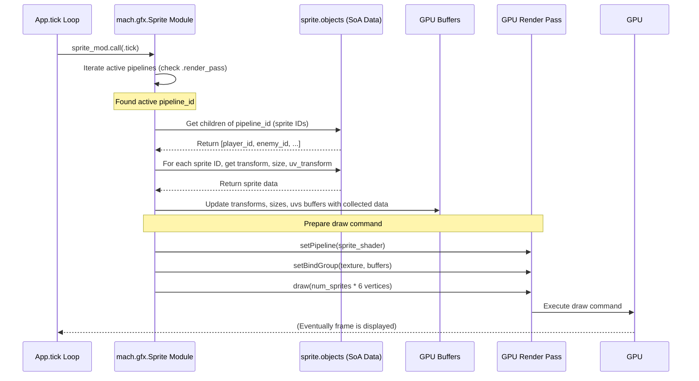

# Chapter 5: High-Level Graphics

> (`mach.gfx`) — *Mach Engine 0.4*

> ***CAUTION**:* *THIS TUTORIAL WAS AI-GENERATED AND MAY CONTAIN ERRORS. IT IS **NOT** AFFILIATED WITH OR ENDORSED BY HEXOPS/MACH.*

In [Chapter 4: Mach Modules](04_mach_modules_.md), we saw how Mach applications are built by combining different "bricks" or modules. We used `mach.Core` for windowing and input, and our own `App` module for overall logic.

But how do we actually *draw* things like characters, backgrounds, or user interfaces? We could use the raw graphics tools directly, but that often involves a lot of complex setup for common tasks. Imagine wanting to draw a simple 2D character (a "sprite") on the screen. You'd need to: load an image file, create a texture on the graphics card (GPU), define the shape to draw (usually two triangles forming a rectangle), write a program (a "shader") telling the GPU how to paint the texture onto the rectangle, and send commands to the GPU every frame. That's a lot of work just for one picture!

This is where `mach.gfx` comes in. It provides ready-made tools for common graphics tasks, making your life much easier.

## Your Graphics Toolkit

Think of `mach.gfx` as a toolbox filled with specialized graphics tools, built on top of the fundamental, lower-level graphics capabilities that we'll cover later in [Chapter 7: Graphics Abstraction](07_mach_sysgpu_.md).

*   **Lower-Level (`mach.sysgpu`):** Provides the basic building blocks – drawing triangles, managing textures, running shader programs. It's powerful but detailed. It's like having individual LEGO bricks.
*   **Higher-Level (`mach.gfx`):** Provides convenient abstractions for common patterns. It's like having pre-assembled LEGO components – a car chassis, a window piece. It uses the basic bricks (`mach.sysgpu`) internally but hides the complexity.

The main tools (modules) currently in the `mach.gfx` toolbox are:

*   **`mach.gfx.Sprite`:** A tool specifically designed for drawing 2D images (sprites). It handles loading textures, setting up shaders, and drawing sprites efficiently, even thousands of them.
*   **`mach.gfx.Text`:** A tool for rendering text. It deals with loading fonts, laying out characters, and drawing them to the screen.

Using `mach.gfx` lets you focus more on *what* you want to draw, rather than the nitty-gritty details of *how* the GPU draws it.

## Putting `mach.gfx.Sprite` to Work: Drawing a Character

Let's focus on the common task of drawing a 2D character sprite using `mach.gfx.Sprite`.

**1. Including the Sprite Module**

First, we need to tell our application that we want to use the `mach.gfx.Sprite` tool. We add it to our `Modules` list in `App.zig`:

```zig
// src/App.zig (Modules declaration)
pub const Modules = mach.Modules(.{
    mach.Core,       // Still need windowing/input
    mach.gfx.Sprite, // <-- Add the Sprite module!
    App,             // Our main application module
});
```

This makes the `Sprite` module available for dependency injection in our systems.

**2. Setting Up the "Pipeline"**

Before we can draw sprites, we need a basic setup. The `Sprite` module uses the concept of a "pipeline". A pipeline defines *how* a group of sprites will be drawn – specifically, which texture they use and which window they appear in.

We typically do this setup once when the window opens. Mach sends a `.window_open` event which we can handle in our `App.tick` system.

```zig
// src/App.zig (Inside App struct)
// Store the ID of our sprite pipeline
pipeline_id: mach.ObjectID = undefined,

// ... other App fields ...

// src/App.zig (Inside App.tick function)
pub fn tick(
    core: *mach.Core,
    app: *App,
    // Dependency injection: Mach gives us access to the Sprite module
    sprite: *gfx.Sprite,
    sprite_mod: mach.Mod(gfx.Sprite),
) !void {
    while (core.nextEvent()) |event| {
        switch (event) {
            // ... other event handling (.key_press, .close) ...
            .window_open => |ev| {
                // --- Pipeline Setup ---
                const window = core.windows.getValue(ev.window_id);

                // 1. Load the image file into a GPU texture
                // (Using a helper function like in the examples)
                const character_texture = try loadTexture(
                    window.device,
                    window.queue,
                    app.allocator,
                    "character.png", // Path to your image
                );

                // 2. Create the pipeline object
                app.pipeline_id = try sprite.pipelines.new(.{
                    .window = ev.window_id, // Link to the window
                    .texture = character_texture, // Use our character image
                    // .render_pass will be set later per frame
                });
                std.log.info("Sprite pipeline created: ID {any}", .{app.pipeline_id});
                // --- End Pipeline Setup ---
            },
            else => {},
        }
    }
    // ... rest of tick ...
```

*   We add `sprite: *gfx.Sprite` and `sprite_mod: mach.Mod(gfx.Sprite)` as parameters to `tick`. Mach automatically provides these because we included `mach.gfx.Sprite` in `Modules`.
*   `loadTexture` is a simplified helper function (like in the `sprite` example) that loads an image (e.g., "character.png") and prepares it for the GPU, returning a `*gpu.Texture`.
*   `sprite.pipelines.new(...)` creates a new pipeline configuration object managed by the `Sprite` module. We link it to the window and the texture it should use.
*   We store the returned `ObjectID` (`app.pipeline_id`) so we can refer to this specific pipeline later.

**3. Creating a Sprite Object**

Now that we have a pipeline, we can create the actual sprite object. Let's create one in our `App.init` function.

```zig
// src/App.zig (Inside App struct)
player_id: mach.ObjectID = undefined, // Store the ID of our player sprite

// ... other App fields ...

// src/App.zig (Inside App.init function, AFTER window creation)
pub fn init(
    core: *mach.Core,
    app: *App,
    app_mod: mach.Mod(App),
    // We can also get sprite access in init if needed
    sprite: *gfx.Sprite,
) !void {
    // ... window creation code ...
    app.window = window;

    // Wait for the pipeline to be created in the first tick
    // For simplicity here, we assume the pipeline exists when we need it.
    // A better approach involves checking if pipeline_id is valid.

    // Create the player sprite object
    app.player_id = try sprite.objects.new(.{
        // Position (center of screen), no rotation, unit scale
        .transform = math.Mat4x4.identity(),
        // Size in pixels (e.g., if the character image is 32x32)
        .size = math.vec2(32.0, 32.0),
        // Use the top-left part of the texture (0,0)
        .uv_transform = math.Mat3x3.identity(),
    });

    // --- IMPORTANT: Link Sprite to Pipeline ---
    // We need to tell the sprite which pipeline it belongs to.
    // This is done by setting the sprite's parent to the pipeline's ID.
    // We assume app.pipeline_id has been set by the time this runs,
    // or handle cases where it might not be ready yet.
    // A robust way is to create sprites AFTER pipeline setup in tick.
    // For this example, we assume pipeline_id is ready (simplification).
    // try sprite.pipelines.setParent(app.player_id, app.pipeline_id);

    std.log.info("Player sprite created: ID {any}", .{app.player_id});
}
```

*   `sprite.objects.new(...)` creates a new sprite data object, managed by the `Sprite` module's internal `mach.Objects` list.
*   `.transform`: A 4x4 matrix ([`mach.math`](09_mach_math_.md)) defining the sprite's position, rotation, and scale in the world. `Mat4x4.identity()` means no transformation (position 0,0,0, no rotation, scale 1). `Mat4x4.translate(math.vec3(x, y, z))` would set its position.
*   `.size`: A 2D vector ([`mach.math`](09_mach_math_.md)) specifying the width and height of the sprite in pixels.
*   `.uv_transform`: A 3x3 matrix ([`mach.math`](09_mach_math_.md)) defining which part of the texture to use. `Mat3x3.identity()` usually means use the texture starting from the top-left corner (0,0). `Mat3x3.translate(math.vec2(u, v))` can be used to select different parts of a sprite sheet.
*   It returns an `ObjectID` (`app.player_id`) for this specific sprite.
*   **Crucially**, you need to link the sprite to a pipeline using `sprite.pipelines.setParent(sprite_id, pipeline_id)`. This tells the `Sprite` module: "When you process `pipeline_id`, please include `sprite_id`." *Note: The example code places creation in `init` for simplicity, but linking requires the `pipeline_id` which is usually created in `tick`. A more robust pattern creates sprites *after* the pipeline is confirmed ready in `tick`.*

**4. Rendering (The Easy Part!)**

How do we draw the sprite every frame? The `Sprite` module does most of the heavy lifting internally when its `tick` system is called. We just need to trigger that system within our main rendering logic in `App.tick`.

```zig
// src/App.zig (Inside App.tick function, near the end)

    // --- Drawing ---
    // Get the window's current surface to draw on
    const window = core.windows.getValue(app.window);
    const back_buffer_view = window.swap_chain.getCurrentTextureView().?;
    defer back_buffer_view.release();

    // Create a command encoder to record drawing commands
    const encoder = window.device.createCommandEncoder(null);
    defer encoder.release();

    // Begin the render pass (clearing the screen to sky blue)
    const color_attachments = [_]gpu.RenderPassColorAttachment{.{
        .view = back_buffer_view,
        .clear_value = gpu.Color{ .r = 0.1, .g = 0.7, .b = 0.9, .a = 1.0 }, // Sky blue
        .load_op = .clear,
        .store_op = .store,
    }};
    const render_pass = encoder.beginRenderPass(&gpu.RenderPassDescriptor.init(.{
        .color_attachments = &color_attachments,
    }));
    defer render_pass.release(); // Ensure render_pass is released

    // --- Tell the Sprite Module to Draw ---
    // 1. Make sure the pipeline knows which render pass to draw into
    sprite.pipelines.set(app.pipeline_id, .render_pass, render_pass);

    // 2. Run the Sprite module's tick system
    sprite_mod.call(.tick);
    // --- Sprite Drawing Done! ---

    // Finish the render pass and submit commands to the GPU
    render_pass.end();
    var command = encoder.finish(null);
    defer command.release(); // Ensure command buffer is released
    window.queue.submit(&[_]*gpu.CommandBuffer{command});
    // --- End Drawing ---
}
```

*   We set up a standard "render pass" – a sequence of drawing operations targeting the window's back buffer. (This uses `mach.sysgpu` concepts briefly).
*   `sprite.pipelines.set(app.pipeline_id, .render_pass, render_pass)` tells the sprite pipeline which render pass context it should use for drawing this frame.
*   `sprite_mod.call(.tick)`: This is the key! We explicitly run the `tick` system of the `Sprite` module. Inside this function, the `Sprite` module finds all active pipelines (like ours), finds all sprites attached to them (like our player), gathers their data, and issues the necessary draw commands to the GPU via `mach.sysgpu`.
*   You don't manually draw each sprite; you just tell the `Sprite` module to do its job for the frame.

**5. Updating the Sprite**

Let's make the player sprite move based on keyboard input. We can modify its `transform` property.

```zig
// src/App.zig (Inside App.tick, after event loop, before drawing)

    // --- Game Logic / Updates ---
    // Check if arrow keys are pressed (using core.keyPressed)
    var move_x: f32 = 0.0;
    if (core.keyPressed(.left)) move_x -= 1.0;
    if (core.keyPressed(.right)) move_x += 1.0;
    // (Similarly for up/down with move_y)

    if (move_x != 0.0) { // Only update if moving
        const speed = 200.0; // Pixels per second
        const delta_time = app.timer.lap(); // Time since last frame

        // Get the current player sprite data
        var player_data = sprite.objects.getValue(app.player_id);

        // Calculate new position
        var current_pos = player_data.transform.translation();
        current_pos.v[0] += move_x * speed * delta_time;

        // Update the transform matrix with the new position
        player_data.transform = math.Mat4x4.translate(current_pos);

        // Save the updated data back to the Sprite module
        sprite.objects.setValue(app.player_id, player_data);
    }
    // --- End Game Logic ---
```

*   We calculate movement based on input and elapsed time (`delta_time`).
*   `sprite.objects.getValue(app.player_id)` retrieves the current data for our player sprite.
*   We modify the `transform` field of the `player_data` struct. We use [`mach.math`](09_mach_math_.md) helpers like `.translation()` to get the position vector and `Mat4x4.translate()` to create a new transform matrix from the updated position.
*   `sprite.objects.setValue(app.player_id, player_data)` writes the modified data back into the `Sprite` module's storage. The next time `sprite_mod.call(.tick)` runs, it will use this updated position.

That's it! `mach.gfx.Sprite` handles the complexity of batching sprites together and telling the GPU how to draw them efficiently using the underlying `mach.sysgpu` tools.

## Under the Hood: How `mach.gfx.Sprite.tick` Works

What magic happens inside `sprite_mod.call(.tick)`?

**High-Level Idea:**

The `Sprite` module acts like a stage manager for sprites. When its `tick` system runs:

1.  **Gather Performers:** It looks at all the `pipeline` objects that have a valid `.render_pass` set for this frame.
2.  **Roll Call:** For each active pipeline, it finds all the `sprite` objects that are linked to it (using the parent relationship we set up).
3.  **Collect Instructions:** It iterates through these linked sprites and collects their current `.transform`, `.size`, and `.uv_transform` data from the `sprite.objects` list.
4.  **Optimize & Prepare:** It puts all this collected data into large, efficient lists (GPU buffers) that the graphics card can read very quickly. It might also sort sprites (e.g., for transparency).
5.  **Send to GPU:** It tells the GPU (using `mach.sysgpu` commands within the provided `render_pass`) to: "Draw a whole batch of rectangles using the data in these buffers, paint them using the pipeline's texture, and use the standard sprite shader program."

This process, called "batching," is much faster than telling the GPU to draw each sprite individually.

**Sequence Diagram (Simplified `sprite.tick`):**



**Code Glance (`src/gfx/Sprite.zig`):**

The core logic resides in `src/gfx/Sprite.zig`.

*   **Module Definition:** It defines the `Sprite` struct, which holds the `mach.Objects` lists for sprites and pipelines.

    ```zig
    // src/gfx/Sprite.zig (Simplified Snippets)
    const Sprite = @This();
    pub const mach_module = .mach_gfx_sprite;
    pub const mach_systems = .{.tick}; // Declares the tick system

    // Manages data for individual sprite instances
    objects: mach.Objects(..., struct {
        transform: Mat4x4,
        uv_transform: Mat3x3,
        size: Vec2,
    }),

    // Manages data for sprite rendering pipelines
    pipelines: mach.Objects(..., struct {
        window: ?mach.ObjectID = null,
        render_pass: ?*gpu.RenderPassEncoder = null,
        texture: *gpu.Texture,
        // ... other pipeline settings (shader, blend state, etc.) ...
        built: ?BuiltPipeline = null, // Internal GPU resources
        num_sprites: u32 = 0, // How many sprites rendered last frame
    }),
    ```
    *   We see the familiar `mach.Objects` structure from [Chapter 2](02_mach_object_system_.md), tailored to hold sprite and pipeline data.

*   **The `tick` System:** This function contains the logic described above.

    ```zig
    // src/gfx/Sprite.zig (Simplified tick system)
    pub fn tick(sprite: *Sprite, core: *mach.Core) !void {
        var pipelines_iter = sprite.pipelines.slice();
        while (pipelines_iter.next()) |pipeline_id| {
            var pipeline = sprite.pipelines.getValue(pipeline_id);

            // Skip if pipeline isn't ready for rendering this frame
            if (pipeline.window == null or pipeline.render_pass == null) continue;

            // Rebuild internal GPU resources if pipeline settings changed
            if (sprite.pipelines.anyUpdated(pipeline_id)) {
                rebuildPipeline(core, sprite, pipeline_id);
                // Reload pipeline data after rebuild
                pipeline = sprite.pipelines.getValue(pipeline_id);
            }

            // Get list of sprites attached to this pipeline
            var pipeline_children = try sprite.pipelines.getChildren(pipeline_id);
            defer pipeline_children.deinit();

            // Check if any attached sprites changed position, size, etc.
            const any_sprites_updated = /* ... check sprite.objects updates ... */;
            if (any_sprites_updated) {
                // Collect data from all children sprites
                // Put data into intermediate CPU buffers (e.g., cp_transforms)
                // Sort sprites if needed (e.g., for Z-depth)
                // Upload data from CPU buffers to GPU buffers
                updatePipelineBuffers(sprite, core, pipeline_id, pipeline_children.items);
                // Update sprite count on pipeline
                pipeline = sprite.pipelines.getValue(pipeline_id);
            }

            // If there are sprites, issue the draw command
            if (pipeline.num_sprites > 0) {
                renderPipeline(sprite, core, pipeline_id); // Issues GPU commands
            }
        }
    }
    ```
    *   The actual `updatePipelineBuffers` and `renderPipeline` functions handle interacting with `mach.sysgpu` to create buffers, upload data (`queue.writeBuffer`), and issue draw calls (`render_pass.draw`).

## What About Text? (`mach.gfx.Text`)

Just like `mach.gfx.Sprite` simplifies drawing images, `mach.gfx.Text` simplifies rendering text. It handles:

*   Loading font files (using libraries like FreeType).
*   Managing a texture atlas (a large texture containing many character shapes, or "glyphs").
*   Calculating character positions (layout).
*   Batching glyphs together and drawing them efficiently, similar to how sprites are batched.

Using `mach.gfx.Text` involves similar steps: include the module, create text styles, create text objects with strings, link them to a text pipeline, and call `text_mod.call(.tick)` during rendering. You can see it in action in the `examples/text` project.

## Conclusion

You've learned about `mach.gfx`, Mach's high-level graphics toolkit designed to make common rendering tasks easier. We saw how modules like `mach.gfx.Sprite` provide convenient ways to draw things like 2D sprites by managing textures, shaders, and batching internally. This lets you create sprites, set their properties (position, size, texture region), link them to a rendering pipeline, and have the module handle the complex GPU interactions when its `tick` system is called.

While `mach.gfx` provides great convenience, it achieves this using shaders – small programs that run on the GPU to determine how things are drawn. Understanding shaders is key to customizing rendering or working directly with the lower-level `mach.sysgpu`.

Let's dive into the world of shaders in [Chapter 6: Shaders (WGSL)](06_shaders_wgsl_.md).

---

Generated by [AI Codebase Knowledge Builder](https://github.com/mnbnkr/Tutorial-Codebase-Knowledge)
