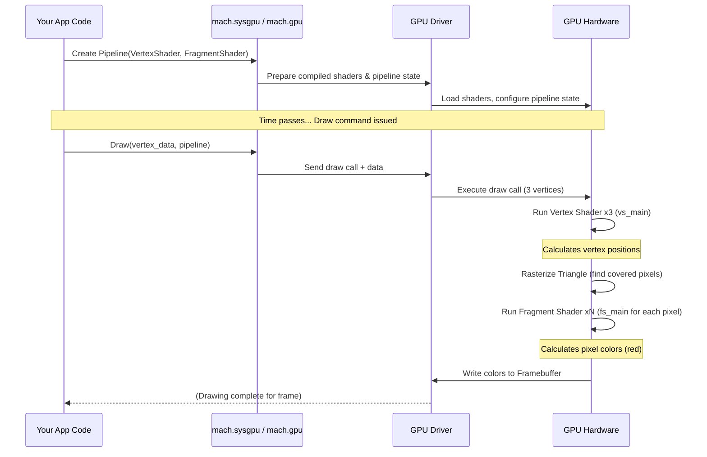

# Chapter 6: Shaders (WGSL)

> *Mach Engine 0.4*

> ***CAUTION**:* *THIS TUTORIAL WAS AI-GENERATED AND MAY CONTAIN ERRORS. IT IS **NOT** AFFILIATED WITH OR ENDORSED BY HEXOPS/MACH.*

In [Chapter 5: High-Level Graphics](05_mach_gfx_.md), we saw how `mach.gfx` makes drawing sprites and text easy. We just created sprite objects, set their positions and textures, and called `sprite_mod.call(.tick)`. But how does the graphics card (GPU) *actually know* how to draw that sprite image onto a rectangle at the correct position on the screen?

The answer lies in **Shaders**. These are the secret instructions we give to the GPU's highly specialized "artists" to tell them exactly how to paint pixels incredibly fast.

## The GPU's Artists and Their Instructions

Imagine your computer's GPU is a team of thousands of tiny, super-fast artists. They don't draw complex scenes like human artists; instead, they specialize in two main tasks: figuring out *where* shapes should be on the screen, and figuring out *what color* each tiny dot (pixel) inside those shapes should be.

Shaders are small programs written in a special language that you provide to these GPU artists. They contain the precise instructions for these two tasks. Mach uses the **WebGPU Shading Language (WGSL)** as its primary way to write these instructions.

Why WGSL? It's a modern language designed for today's graphics APIs (like WebGPU, Vulkan, Metal, DirectX 12) and is designed to be safe and performant. Mach takes your WGSL code and automatically translates it into the specific format needed by the user's computer (like SPIR-V, HLSL, or MSL), so you don't have to worry about those details!

## Key Concepts: The Two Main Artist Roles

There are different types of shaders for different tasks, but for drawing graphics, the two most important ones are:

1.  **Vertex Shader:** This shader's job is to figure out the final position of each corner (vertex) of a shape you want to draw.
    *   **Input:** It usually receives the original position of a vertex (from a 3D model or a 2D shape) and other data like texture coordinates or colors. It might also get information like the camera's position or the object's position in the world.
    *   **Output:** Its main goal is to calculate and output the vertex's final position on the screen (a special coordinate system the GPU understands).
    *   **Analogy:** This is the artist who takes the blueprint for a triangle and calculates exactly where its corners should appear on the final canvas, considering perspective, object movement, etc.

2.  **Fragment Shader (Pixel Shader):** After the vertex shader positions the shape's corners, the GPU figures out which pixels on the screen are inside that shape. For each of those pixels, the fragment shader runs to decide its final color.
    *   **Input:** It often receives data interpolated from the vertices (like texture coordinates or vertex colors) and can access textures (images).
    *   **Output:** Its main goal is to calculate and output the final color for the specific pixel it's working on.
    *   **Analogy:** This is the artist who goes pixel-by-pixel within the outline drawn by the vertex artist and decides precisely what color to paint each spot, perhaps by looking up a color from a texture image or calculating lighting effects.

*(There are also Compute Shaders for general-purpose calculations, but we'll focus on vertex and fragment shaders for graphics).*

## Writing Shaders: A Glimpse of WGSL

Let's look at some very simple WGSL code to see what these shader programs look like. WGSL has a C-like syntax but with some specific features for GPU programming.

**1. A Minimal Vertex Shader**

Imagine we want to draw a simple triangle. We need a vertex shader to tell the GPU where the triangle's three corners are.

```rust
// File: simple_triangle.wgsl (Vertex Part)

// This function defines our vertex shader.
// '@vertex' tells the compiler this is a vertex shader.
@vertex
fn vs_main(
    // '@builtin(vertex_index)' is special input: 0 for the first vertex,
    // 1 for the second, 2 for the third, etc.
    @builtin(vertex_index) vertex_index : u32
) ->
// '->' indicates the output type.
// '@builtin(position)' is special output: the final screen position.
// 'vec4<f32>' is a 4D vector (x, y, z, w) of 32-bit floats.
@builtin(position) vec4<f32> {
    // Define the 2D positions of our triangle's corners.
    // 'array<vec2<f32>, 3>' is an array of three 2D float vectors.
    var positions = array<vec2<f32>, 3>(
        vec2<f32>( 0.0,  0.5), // Top vertex
        vec2<f32>(-0.5, -0.5), // Bottom-left vertex
        vec2<f32>( 0.5, -0.5)  // Bottom-right vertex
    );

    // Select the position based on which vertex we're processing.
    let pos_2d = positions[vertex_index];

    // Return the final 4D position.
    // We add z=0.0 (depth) and w=1.0 (needed for perspective calculations).
    return vec4<f32>(pos_2d, 0.0, 1.0);
}
```

*   `@vertex`: Marks the function `vs_main` as the entry point for the vertex shader.
*   `@builtin(vertex_index) vertex_index : u32`: This gives us a unique number for each vertex being processed.
*   `array<...>` and `vec2<f32>`: WGSL has built-in types for vectors and arrays, common in graphics.
*   `@builtin(position) vec4<f32>`: This is the *required* output of a vertex shader – the final position of the vertex in "clip space" coordinates (usually ranging from -1 to +1 in X and Y). The `w` component is important for perspective division later.
*   This shader simply looks up a predefined 2D position based on the `vertex_index` and returns it as the required 4D position.

**2. A Minimal Fragment Shader**

Now we need a fragment shader to tell the GPU what color to make the pixels *inside* the triangle defined by the vertex shader.

```rust
// File: simple_triangle.wgsl (Fragment Part)

// This function defines our fragment shader.
// '@fragment' tells the compiler this is a fragment shader.
@fragment
fn fs_main() ->
// '->' indicates the output type.
// '@location(0)' means this output goes to the first render target (usually the screen).
// 'vec4<f32>' here represents color: (Red, Green, Blue, Alpha).
@location(0) vec4<f32> {
    // Return a solid red color (R=1.0, G=0.0, B=0.0, Alpha=1.0).
    // Colors usually range from 0.0 to 1.0.
    return vec4<f32>(1.0, 0.0, 0.0, 1.0);
}

```

*   `@fragment`: Marks the function `fs_main` as the entry point for the fragment shader.
*   `@location(0) vec4<f32>`: This defines the output color for the pixel. `@location(0)` specifies that this color should be written to the first "color attachment" of the render target (which is typically the main window buffer). The `vec4` represents RGBA (Red, Green, Blue, Alpha).
*   This extremely simple shader just returns the fixed color red for every pixel inside the triangle.

When the GPU draws the triangle:
1.  It runs `vs_main` three times (once for each `vertex_index` 0, 1, 2) to find the screen positions of the corners.
2.  It figures out all the pixels on the screen that fall inside this triangle (this step is called Rasterization).
3.  For *each* of those pixels, it runs `fs_main` to get its color (which is always red in this case).
4.  The result is a red triangle drawn on the screen!

## How Mach Uses WGSL Shaders

You typically write your WGSL code in `.wgsl` files (like the `shader.wgsl` file in the `core-custom-entrypoint` example or the `sprite.wgsl` and `text.wgsl` files used internally by `mach.gfx`).

How does this WGSL code get used by the engine?

1.  **Build System Integration:** You tell the Mach build system about your shader files in your `build.zig` file. Mach provides helpers to include these `.wgsl` files directly into your application executable. See [Chapter 10: Build System](10_build_system_.md).

    ```zig
    // build.zig (Simplified example)
    const optimize = b.standardOptimizeOption(.{});

    const exe = b.addExecutable(.{
        .name = "my_app",
        .root_source_file = .{ .path = "src/main.zig" },
        .target = target,
        .optimize = optimize,
    });

    // Tell Mach to compile WGSL shaders and link them
    // The key ".app" here matches the module name using the shader
    // The value is a list of WGSL source files
    try mach.generateShaders(exe, .{
        .app = &.{ // Assumes a module named 'app' uses this shader
             "src/simple_triangle.wgsl",
         },
    });

    // ... rest of build script ...
    ```

2.  **Compilation:** When you build your application, Mach's build system preprocesses the WGSL files. During runtime initialization (or sometimes compile-time), Mach takes the WGSL source code and uses internal tools (found in `src/sysgpu/shader.zig`) to:
    *   **Parse & Analyze:** Understand the WGSL code structure and check for errors.
    *   **Translate:** Convert the WGSL into an intermediate format called SPIR-V.
    *   **Cross-Compile (if needed):** Use tools like SPIRV-Cross to translate the SPIR-V into the specific shading language required by the target platform's graphics API (HLSL for DirectX on Windows, MSL for Metal on macOS/iOS).

3.  **GPU Execution:** The final, platform-specific shader code is then handed over to the graphics driver and GPU when you set up a rendering pipeline using the lower-level graphics abstraction ([Chapter 7: Graphics Abstraction](07_mach_sysgpu_.md)). When you issue draw calls, the GPU executes these compiled shader programs.

This process means you write your shaders once in WGSL, and Mach handles making them work across different platforms and graphics backends!

## Under the Hood: The Graphics Pipeline

Let's visualize the basic flow when shaders are involved in drawing something like our triangle.

**High-Level Walkthrough:**

1.  **Your Code:** Tells `mach.sysgpu` to draw 3 vertices using a specific "pipeline" that includes our compiled vertex and fragment shaders.
2.  **Data Transfer:** The positions (if not hardcoded like in our example) and other vertex data are sent to the GPU memory.
3.  **Vertex Shading:** The GPU runs the `vs_main` vertex shader for each of the 3 vertices, calculating their final screen positions.
4.  **Rasterization:** The GPU figures out which pixels on the screen are covered by the triangle formed by these final vertex positions.
5.  **Fragment Shading:** For each covered pixel, the GPU runs the `fs_main` fragment shader to determine its color.
6.  **Output:** The calculated colors are written to the screen buffer (framebuffer), and eventually, the red triangle appears!

**Simplified Sequence Diagram:**



**Code Glance:**

*   **WGSL Examples:**
    *   `examples/core-custom-entrypoint/shader.wgsl`: The minimal triangle shader we looked at.
    *   `src/gfx/sprite.wgsl`: The shader used internally by `mach.gfx.Sprite`. It takes vertex position, size, and texture coordinates as input and calculates the final position and texture lookup coordinates. The fragment shader samples the texture and outputs the color.
    *   `src/gfx/text.wgsl`: The shader used by `mach.gfx.Text`, similar to the sprite shader but specialized for glyphs from a font atlas.
*   **Compilation Logic:**
    *   `src/sysgpu/shader.zig`: This is the entry point for shader processing in Mach. It contains the `Ast` (Abstract Syntax Tree), `Parser`, `CodeGen`, etc., for handling WGSL.
    *   `src/sysgpu/shader/CodeGen.zig`: Contains the logic to generate different output languages (SPIR-V, MSL, HLSL, GLSL). It likely uses external libraries or tools like `spirv-tools` and `spirv-cross` under the hood.
    *   `build.zig` (`mach.generateShaders`): The build system integration point that invokes the shader compilation process.

You usually don't need to interact directly with the shader compilation code unless you're modifying the engine, but knowing it exists helps understand how your `.wgsl` files become executable GPU code.

## Conclusion

You've learned about shaders, the small but powerful programs that run on the GPU to control how graphics are drawn. We focused on the two main types for rendering: vertex shaders (calculating positions) and fragment shaders (calculating colors). You saw the basics of WGSL, Mach's chosen shading language, and how minimal shaders define the rendering process. We also discussed how Mach integrates WGSL files into the build process and compiles them into platform-specific code for the GPU.

While high-level modules like [`mach.gfx`](05_mach_gfx_.md) hide the direct use of shaders for common tasks, understanding them is crucial for customizing rendering or performing advanced graphics techniques. Shaders are loaded and managed by Mach's lower-level graphics abstraction layer.

Let's now explore that layer in [Chapter 7: Graphics Abstraction](07_mach_sysgpu_.md).

---

Generated by [AI Codebase Knowledge Builder](https://github.com/mnbnkr/Tutorial-Codebase-Knowledge)
