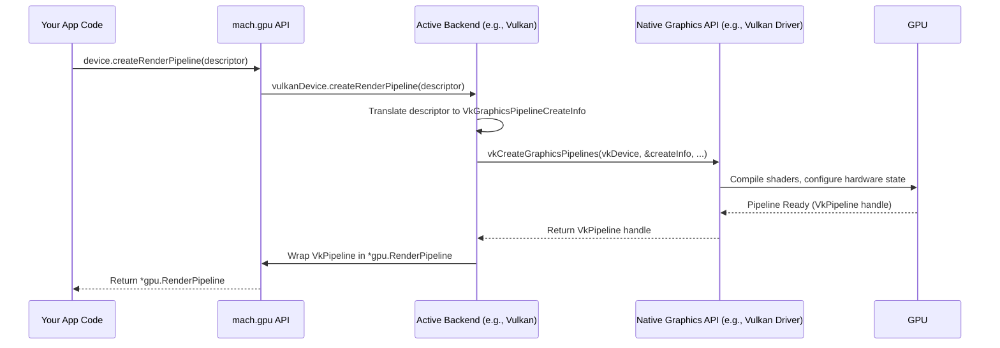

# Chapter 7: Graphics Abstraction

> (`mach.sysgpu` / `mach.gpu`) — *Mach Engine 0.4*

> ***CAUTION**:* *THIS TUTORIAL WAS AI-GENERATED AND MAY CONTAIN ERRORS. IT IS **NOT** AFFILIATED WITH OR ENDORSED BY HEXOPS/MACH.*

In [Chapter 6: Shaders (WGSL)](06_shaders_wgsl_.md), we learned how to write instructions (shaders) that tell the graphics card (GPU) how to draw things. We saw how WGSL lets us define vertex positions and pixel colors. But how does our Mach application actually *talk* to the GPU to load those shaders, provide data, and tell it "Okay, draw now!"?

This communication happens through a **Graphics API** (Application Programming Interface). Think of APIs like Vulkan, Metal, DirectX 12, or OpenGL. They are like specific languages that the GPU driver understands. The problem? Each language is different! Code written for Vulkan won't work directly on a system that only understands Metal (like macOS).

This is where `mach.sysgpu` comes in. For convenience, we often use the alias `mach.gpu` when writing code.

## The Universal Translator for Graphics

Imagine you want to give instructions to artists who speak different languages (Vulkan, Metal, DirectX). You could learn all those languages yourself, which is hard work and you'd have to write your instructions multiple times. Or, you could hire a universal translator.

`mach.sysgpu` (often used via the `mach.gpu` alias in code) is that **universal translator** for graphics commands.

*   **You speak one language:** You tell `mach.gpu` what you want to do using its consistent set of commands (e.g., "create a texture," "load this shader," "draw 3 vertices").
*   **It translates:** `mach.gpu` figures out which "language" the local GPU driver speaks (Vulkan, Metal, D3D12, etc.) and translates your command into that specific language.
*   **Works anywhere (mostly):** Your graphics code remains largely the same whether your application runs on Windows, macOS, or Linux, because `mach.gpu` handles the platform-specific details.

It's the fundamental layer that Mach uses to interact with graphics hardware. Higher-level tools like [High-Level Graphics](05_mach_gfx_.md) use `mach.gpu` under the hood to perform their tasks.

## Key Concepts: The Building Blocks of GPU Communication

Interacting with the GPU involves several steps and concepts, which `mach.gpu` provides a consistent interface for:

1.  **Adapter:** Represents a physical GPU (or sometimes a software renderer) available on the system. You might have multiple adapters (e.g., an integrated Intel GPU and a dedicated Nvidia GPU). You usually pick one to use.
2.  **Device:** Represents your application's logical connection to an Adapter. It's the main object you use to create other GPU resources. Think of it as opening a communication channel to the chosen GPU.
3.  **Queue:** A command submission queue for the Device. You send batches of recorded commands to the Queue, which then delivers them to the GPU for execution.
4.  **Resources:** These are the "things" you create on the GPU:
    *   **Buffers:** Chunks of memory for storing data like vertex coordinates, colors, or indices.
    *   **Textures:** Images used for drawing (like sprite sheets) or as render targets.
    *   **Samplers:** Tell the GPU how to read from textures (e.g., with filtering or wrapping).
    *   **Shader Modules:** Compiled shader code (like our WGSL from Chapter 6) loaded onto the GPU.
    *   **Pipeline Layouts & Bind Group Layouts:** Define how different resources (buffers, textures) are grouped and accessed by shaders.
    *   **Pipelines (Render/Compute):** The main state object that combines shaders, vertex formats, blend states, etc., defining *how* to draw something or perform a computation.
5.  **Command Encoder:** An object used to record a sequence of GPU commands (like setting a pipeline, binding resources, drawing).
6.  **Command Buffer:** The result of finishing a Command Encoder. It's a package of recorded commands ready to be sent to the Queue.
7.  **SwapChain:** Manages the sequence of images presented to the screen for a window. It handles details like double or triple buffering.

The general flow is:
Get Adapter -> Get Device & Queue -> Create Resources (Shaders, Pipeline, Buffers...) -> Record Commands (Encoder) -> Submit Commands (Queue).

## Putting `mach.gpu` to Work: Drawing Our Triangle

Let's revisit the simple triangle from [Chapter 6: Shaders (WGSL)](06_shaders_wgsl_.md). How would we use `mach.gpu` *directly* to draw it? (Note: This is more involved than using `mach.gfx`, but shows the underlying process).

We'll assume we have a `window` object obtained from [Chapter 1: Mach Core (Windowing & Input)](01_mach_core_.md), which already gives us access to the `Device` and `Queue`. We also assume our WGSL shader (`simple_triangle.wgsl`) has been processed by the build system ([Chapter 10: Build System](10_build_system_.md)).

**1. Getting the Device and Queue**

In our `App.tick` or similar system, we can access the GPU resources associated with our window.

```zig
const gpu = mach.gpu; // Convenient alias

// Assume 'core' is mach.Core and 'app.window' is the ObjectID from Core
const window = core.windows.getValue(app.window);
const device = window.device; // Get the logical GPU device
const queue = window.queue;   // Get the command queue
```

*   `mach.Core` conveniently provides the `device` and `queue` associated with a window once it's opened and ready for drawing.

**2. Creating a Render Pipeline**

We need to combine our shaders into a pipeline state object.

```zig
const gpu = mach.gpu;

// Assume 'shader_module' is a *gpu.ShaderModule created by the build system/loader
// for our "simple_triangle.wgsl" file.
const pipeline_layout = device.createPipelineLayout(null); // No resources needed yet
defer pipeline_layout.release();

const pipeline = device.createRenderPipeline(.{
    .layout = pipeline_layout,
    .vertex = .{
        .module = shader_module,
        .entry_point = "vs_main", // Function name in WGSL
    },
    .fragment = .{
        .module = shader_module,
        .entry_point = "fs_main", // Function name in WGSL
        .targets = &.{.{ // Describe the output format
            .format = window.swap_chain.getFormat(), // Match window's format
        }},
    },
    .primitive = .{ .topology = .triangle_list }, // We're drawing triangles
});
// Keep 'pipeline' alive for drawing, release it later (e.g., in deinit)
// For simplicity here, assume we store it in 'app.pipeline'
app.pipeline = pipeline;
```

*   `device.createPipelineLayout(null)`: Creates a layout describing resource bindings. `null` means our simple shader doesn't need any external buffers or textures yet.
*   `device.createRenderPipeline(...)`: This is the main command. We tell it:
    *   Which `layout` to use.
    *   The `vertex` shader module and its entry function (`vs_main`).
    *   The `fragment` shader module and its entry function (`fs_main`).
    *   The `targets` describe the color output format(s). We need to match the format of the window's SwapChain where we'll draw.
    *   The `primitive` state tells it we are drawing a list of triangles.
*   This returns a `*gpu.RenderPipeline` object. We need to store this (e.g., in `app.pipeline`) and `release()` it when we're done (usually in `deinit`).

**3. Recording Draw Commands**

Inside our `tick` function, each frame, we record the commands needed to draw.

```zig
const gpu = mach.gpu;

// Get the texture view to draw into for the current frame
const back_buffer_view = window.swap_chain.getCurrentTextureView().?;
defer back_buffer_view.release();

// Create a command encoder to record commands
const encoder = device.createCommandEncoder(null);
defer encoder.release();

// Start a render pass
const render_pass = encoder.beginRenderPass(&.{
    .color_attachments = &.{.{ // Configure the render target
        .view = back_buffer_view, // Draw to the window's back buffer
        .load_op = .clear,       // Clear the screen before drawing
        .store_op = .store,      // Store the result
        .clear_value = .{ .r = 0.1, .g = 0.2, .b = 0.3, .a = 1.0 }, // Dark blue clear
    }},
});
defer render_pass.release();

// --- Record Drawing Commands ---
render_pass.setPipeline(app.pipeline); // Use the pipeline we created
render_pass.draw(3, 1, 0, 0);          // Draw 3 vertices, 1 instance
// --- End Recording ---

render_pass.end(); // Finish the render pass

// Finish encoding commands into a command buffer
var command = encoder.finish(null);
defer command.release();
```

*   `window.swap_chain.getCurrentTextureView()`: Gets the specific image from the window's buffer sequence that we should draw to this frame.
*   `device.createCommandEncoder()`: Creates the recorder.
*   `encoder.beginRenderPass()`: Starts a rendering phase. We configure the `color_attachments` array:
    *   `.view`: Where to draw (the window's back buffer).
    *   `.load_op`: What to do at the start (`.clear` the view).
    *   `.store_op`: What to do at the end (`.store` the result).
    *   `.clear_value`: The color to use for clearing.
*   `render_pass.setPipeline(app.pipeline)`: Selects the pipeline (with our shaders) to use for subsequent draw calls.
*   `render_pass.draw(3, 1, 0, 0)`: The core draw command! It tells the GPU to run the current pipeline's vertex shader 3 times (for 3 vertices), assemble a triangle, and run the fragment shader for pixels inside. Because our vertex shader hardcoded positions based on `vertex_index`, we don't need separate vertex buffers here.
*   `render_pass.end()`: Finishes the rendering phase.
*   `encoder.finish()`: Packages all recorded commands into a `*gpu.CommandBuffer`.

**4. Submitting Commands to the GPU**

Finally, we send the packaged commands to the GPU via the queue.

```zig
const gpu = mach.gpu;

// Submit the command buffer to the queue for execution
queue.submit(&[_]*gpu.CommandBuffer{command});

// (The window presentation usually happens automatically or via core.present())
```

*   `queue.submit(&[_]*gpu.CommandBuffer{command})`: Takes an array of command buffers and sends them off to the GPU driver to be executed.

And that's it! The GPU receives the commands, runs our vertex shader to position the triangle, runs our fragment shader to color it red, and the result appears in the window. This is much more verbose than using `mach.gfx`, but it shows the level of control `mach.gpu` provides.

## Under the Hood: The Translation Layer

How does `mach.gpu` make `device.createRenderPipeline(...)` work on both Vulkan and Metal?

**High-Level Idea:**

1.  **API Call:** Your code calls a `mach.gpu` function like `device.createRenderPipeline(descriptor)`.
2.  **Dispatch:** `mach.gpu` internally looks up which backend (Vulkan, Metal, D3D12, etc.) is currently active for this `device`.
3.  **Translation:** It calls the corresponding function in the *backend-specific implementation* (e.g., `VulkanDevice.createRenderPipeline` or `MetalDevice.createRenderPipeline`).
4.  **Backend Implementation:** This backend-specific function takes the generic `mach.gpu.RenderPipeline.Descriptor` and translates it into the concepts and structures required by the *native* graphics API (e.g., `vkCreateGraphicsPipelines` for Vulkan, or creating `MTLRenderPipelineState` for Metal).
5.  **Native Call:** The backend implementation makes the actual calls to the native graphics driver.
6.  **Return:** It wraps the resulting native object (like `VkPipeline` or `id<MTLRenderPipelineState>`) inside a `mach.gpu` object handle (`*gpu.RenderPipeline`) and returns it to your code.

Your application code only ever interacts with the standard `mach.gpu` interface, while the backend implementations handle the details of talking to the specific native APIs.

**Sequence Diagram (Simplified `device.createRenderPipeline`):**



**Code Glance:**

The magic happens between the public API definition and the backend implementations.

*   **`src/sysgpu/sysgpu/main.zig`:** Defines the public `mach.gpu` types and functions (like `RenderPipeline.Descriptor`, `Device.createRenderPipeline`).
*   **`src/sysgpu/main.zig`:** This file sets up the `Impl` structure, which acts as the dispatch table. Based on the chosen backend at compile time, it points the generic API functions (like `deviceCreateRenderPipeline`) to the specific implementation in the backend files.

    ```zig
    // src/sysgpu/main.zig (Conceptual Snippet)
    const backend_type = .vulkan; // Determined at compile time
    const impl = switch (backend_type) {
        .vulkan => @import("vulkan.zig"),
        .metal => @import("metal.zig"),
        .d3d12 => @import("d3d12.zig"),
        // ... other backends ...
    };

    // 'Impl' essentially defines the functions that the public API calls
    pub const Impl = sysgpu.Interface(struct {
        // ... other function implementations ...

        pub inline fn deviceCreateRenderPipeline(
            device_raw: *sysgpu.Device,
            descriptor: *const sysgpu.RenderPipeline.Descriptor
        ) *sysgpu.RenderPipeline {
            // Cast the generic *sysgpu.Device to the specific backend type
            const device: *impl.Device = @ptrCast(@alignCast(device_raw));
            // Call the backend-specific implementation
            const render_pipeline = device.createRenderPipeline(descriptor) catch @panic("api error");
            // Cast the backend-specific pipeline back to the generic type for the user
            return @as(*sysgpu.RenderPipeline, @ptrCast(render_pipeline));
        }

        // ... other function implementations ...
    });
    ```
    *   The public `gpu.Device.createRenderPipeline` function eventually calls `Impl.deviceCreateRenderPipeline`.
    *   This function casts the generic `*gpu.Device` pointer to the actual backend type (e.g., `*vulkan.Device`) and calls *its* `createRenderPipeline` method.
    *   The backend method does the real work using native API calls.

*   **`src/sysgpu/vulkan.zig`, `src/sysgpu/metal.zig`, `src/sysgpu/d3d12.zig`, etc.:** These files contain the actual backend implementations. For example, `src/sysgpu/vulkan.zig`'s `Device.createRenderPipeline` function contains the logic to translate the `sysgpu` descriptor into Vulkan structures and call `vkCreateGraphicsPipelines`. You generally don't need to look into these files unless you're contributing to the engine or debugging a backend-specific issue.

## Conclusion

You've learned about `mach.sysgpu` (or `mach.gpu`), Mach's low-level graphics abstraction layer. It acts as a universal translator, providing a consistent API for interacting with the GPU across different platforms and native graphics libraries like Vulkan, Metal, and DirectX 12. You saw the key concepts involved (Adapter, Device, Queue, Resources, Pipelines, Command Encoders) and walked through a basic example of how to use `mach.gpu` directly to set up a render pipeline and draw a triangle, highlighting the steps involved in communicating with the GPU. We also briefly touched on how `mach.gpu` uses backend-specific implementations to translate your commands into native API calls.

This abstraction layer is the bedrock upon which all graphics in Mach are built, whether through high-level tools like [`mach.gfx`](05_mach_gfx_.md) or direct interaction.

Just as `mach.sysgpu` provides a way to talk to graphics hardware, Mach also provides an abstraction for audio hardware. Let's explore that next.

Let's move on to [Chapter 8: Audio Abstraction](08_mach_sysaudio_.md).

---

Generated by [AI Codebase Knowledge Builder](https://github.com/mnbnkr/Tutorial-Codebase-Knowledge)
