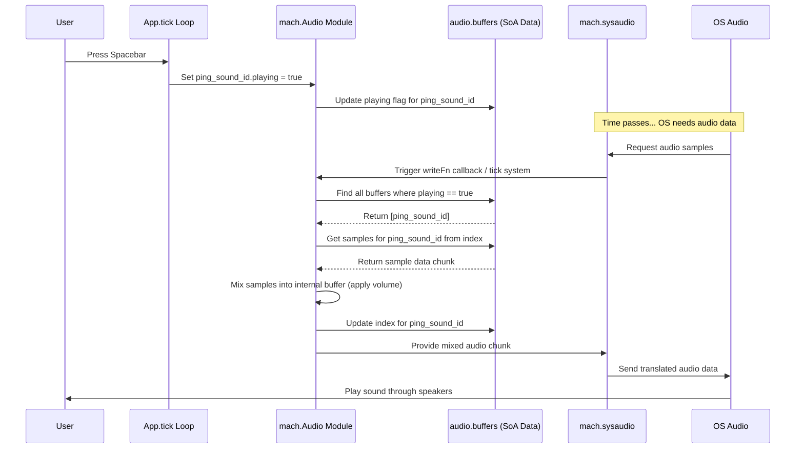

# Chapter 8: Audio Abstraction

> (`mach.sysaudio` / `mach.Audio`) — *Mach Engine 0.4*

> ***CAUTION**:* *THIS TUTORIAL WAS AI-GENERATED AND MAY CONTAIN ERRORS. IT IS **NOT** AFFILIATED WITH OR ENDORSED BY HEXOPS/MACH.*

Welcome to Chapter 8! In [Chapter 7: Graphics Abstraction](07_mach_sysgpu_.md), we explored how Mach provides a universal way to talk to your computer's graphics card (GPU). Now, let's turn our attention from visuals to sound. How does Mach help us play sound effects or music in our applications?

## The Universal Remote for Sound

Imagine you want your application to make a "ping!" sound when the user clicks a button. Just like drawing graphics, playing sound involves talking to the operating system (OS) and the underlying hardware. Different operating systems have different ways of handling audio:

*   **Windows:** Uses APIs like WASAPI or DirectSound.
*   **macOS/iOS:** Uses CoreAudio.
*   **Linux:** Might use ALSA, PipeWire, or PulseAudio.

Writing code to handle all these different systems directly would be complicated! You'd need separate code for each OS.

This is where Mach's audio abstraction comes in, primarily through the `mach.Audio` module, which builds upon the lower-level `mach.sysaudio` layer.

*   **`mach.sysaudio`:** Similar to `mach.sysgpu`, this is the low-level *translator*. It understands how to speak the specific audio "language" of each OS (WASAPI, CoreAudio, ALSA, etc.). You generally don't interact with it directly unless you need very fine-grained control.
*   **`mach.Audio`:** This is a higher-level module, like [`mach.gfx`](05_mach_gfx_.md), that provides a convenient way to manage and play sounds. It uses `mach.sysaudio` behind the scenes. Think of `mach.Audio` as a user-friendly **universal remote control** for your computer's sound system. You tell `mach.Audio` "play this sound," and it figures out the rest using `mach.sysaudio`.

This chapter focuses on using the `mach.Audio` module for common audio tasks.

## Key Concepts

Let's understand the main ideas within `mach.Audio`:

*   **Audio Context:** Represents the connection to the system's audio capabilities. `mach.Audio` manages this internally.
*   **Audio Device:** Represents a physical sound output (speakers, headphones) or input (microphone). `mach.Audio` typically uses the system's default output device.
*   **Audio Buffer:** A chunk of memory holding the actual sound data. Sound is usually represented as a sequence of numbers (samples) that describe the shape of the sound wave over time. `mach.Audio` uses `f32` (floating-point numbers between -1.0 and 1.0) for its internal processing.
*   **Audio Buffer Object:** Managed by `mach.Audio` using [`mach.Objects`](02_mach_object_system_.md). Each object represents a sound you want to play, holding the audio data (samples), volume, and playback state (playing or stopped).
*   **Mixing:** If you want to play multiple sounds at once, their sound waves need to be combined (mixed) together. `mach.Audio` handles this mixing automatically in its `tick` system.
*   **Streaming:** `mach.Audio` plays sound by continuously sending small chunks of mixed audio data to the OS via `mach.sysaudio`.

## Putting `mach.Audio` to Work: Playing a "Ping" Sound

Let's walk through the steps to play a simple sound effect using the `mach.Audio` module.

**1. Including the Audio Module**

First, we need to add `mach.Audio` to our application's list of modules in `App.zig`.

```zig
// src/App.zig (Modules declaration)
pub const Modules = mach.Modules(.{
    mach.Core,       // For windowing/input
    mach.Audio,      // <-- Add the Audio module!
    App,             // Our main application module
    // Other modules like mach.gfx.Sprite might also be here
});
```

This makes the `Audio` module's features and state available through dependency injection.

**2. Loading or Generating Sound Data**

We need the actual sound data. For a real application, you'd load this from a file (like a `.wav` or `.ogg` file) using a library. For this example, let's *imagine* we have a function `loadPingSound()` that returns the sound data as a slice of `f32` samples. We'll also assume it's a mono (1 channel) sound.

```zig
// src/App.zig (Conceptual - outside the main App struct)

// Pretend this function loads our sound and returns the samples
fn loadPingSound(allocator: std.mem.Allocator) ![]f32 {
    // In reality, this would open a file, decode it, and allocate memory.
    // For simplicity, let's return a short, simple sound wave (a quick beep).
    const sample_rate = 48000; // Samples per second
    const duration_ms = 100; // 100 milliseconds
    const num_samples = sample_rate * duration_ms / 1000;
    var samples = try allocator.alloc(f32, num_samples);

    const frequency = 880.0; // A high 'A' note
    for (samples, 0..) |*sample, i| {
        const time = @as(f32, @floatFromInt(i)) / @as(f32, @floatFromInt(sample_rate));
        // Simple sine wave - fades out quickly
        sample.* = @sin(2.0 * std.math.pi * frequency * time) * (@max(0.0, 1.0 - (time * 10.0)));
    }
    return samples;
}
```

*   This function generates a simple sine wave sound that fades out.
*   The important part is that it returns `[]f32`, which is the format `mach.Audio` expects.

**3. Creating an Audio Buffer Object**

In our `App.init` function, after loading the sound, we create an object within `mach.Audio` to manage it.

```zig
// src/App.zig (Inside App struct)
ping_sound_id: mach.ObjectID = undefined, // Store the ID of our sound
ping_sound_samples: []f32 = &.{}, // Store the loaded samples

// ... other App fields ...

// src/App.zig (Inside App.init function)
pub fn init(
    core: *mach.Core,
    app: *App,
    app_mod: mach.Mod(App),
    // Dependency injection: Get access to the Audio module
    audio: *mach.Audio,
) !void {
    // ... other init code (window setup, etc.) ...

    // Load the sound data (using our conceptual function)
    app.ping_sound_samples = try loadPingSound(app.allocator); // Assuming app.allocator exists

    // Create an audio buffer object in the Audio module
    app.ping_sound_id = try audio.buffers.new(.{
        .samples = app.ping_sound_samples, // The sound data
        .channels = 1, // 1 for mono, 2 for stereo
        .playing = false, // Don't start playing immediately
        .volume = 0.8, // Slightly less than full volume
    });

    std.log.info("Created ping sound buffer: ID {any}", .{app.ping_sound_id});
    // ... rest of init ...
}
```

*   We add `audio: *mach.Audio` as a parameter to `init` to get access to the module.
*   `loadPingSound` gets the audio data (we store it in `app.ping_sound_samples` to keep it alive).
*   `audio.buffers.new(...)` creates a new object managed by the `Audio` module's internal `mach.Objects` list.
    *   `.samples`: We provide the slice containing our sound wave data.
    *   `.channels`: We specify if it's mono (1) or stereo (2).
    *   `.playing`: Set to `false` initially. We'll set this to `true` to trigger the sound.
    *   `.volume`: A multiplier (0.0 to 1.0+) for this specific sound.
*   We store the returned `ObjectID` (`app.ping_sound_id`) to refer to this sound later.

**4. Triggering Playback**

Now, let's say we want to play the sound when the user presses the spacebar. We can do this in our `App.tick` function.

```zig
// src/App.zig (Inside App.tick function)
pub fn tick(
    core: *mach.Core,
    app: *App,
    audio: *mach.Audio, // Get access to Audio module here too
    audio_mod: mach.Mod(Audio), // Get module handle if needed
) void {
    while (core.nextEvent()) |event| {
        switch (event) {
            // --- Trigger Sound on Key Press ---
            .key_press => |ev| {
                if (ev.key == .space) {
                    std.log.info("Space pressed! Playing ping sound.", .{});
                    // Reset the sound's position and start playing
                    audio.buffers.lock(); // Lock before modifying
                    defer audio.buffers.unlock(); // Ensure unlock

                    var buffer_data = audio.buffers.getValue(app.ping_sound_id);
                    buffer_data.index = 0; // Reset playhead to the beginning
                    buffer_data.playing = true; // Tell Audio module to start playing this buffer
                    audio.buffers.setValue(app.ping_sound_id, buffer_data); // Save changes
                }
            },
            // ... other event handling (.close, etc.) ...
            else => {},
        }
    }

    // --- Check if sound finished (Optional) ---
    // The Audio module automatically sets 'playing' to false when a buffer finishes.
    // We can check this if we need to react when a sound stops.
    // audio.buffers.lock();
    // defer audio.buffers.unlock();
    // const is_ping_playing = audio.buffers.getValue(app.ping_sound_id).playing;
    // if (app.was_ping_playing and !is_ping_playing) {
    //     std.log.debug("Ping sound finished playing.", .{});
    // }
    // app.was_ping_playing = is_ping_playing; // Need to track previous state

    // ... rest of tick (drawing, etc.) ...

    // IMPORTANT: The actual mixing and sending to hardware happens
    // implicitly when the Audio module's own internal 'tick' system runs,
    // or via its callback mechanism triggered by sysaudio. You don't
    // usually need to call audio_mod.call(.tick) manually unless you have
    // a very specific setup.
}
```

*   We check for a spacebar key press event.
*   **Locking:** We use `audio.buffers.lock()` and `defer audio.buffers.unlock()` before getting/setting buffer data, just like with any [`mach.Objects`](02_mach_object_system_.md) list, to ensure data safety.
*   `audio.buffers.getValue(app.ping_sound_id)` gets the current state of our sound buffer.
*   We set `.index = 0` to ensure the sound plays from the beginning each time space is pressed.
*   We set `.playing = true`. This is the signal to the `mach.Audio` module's internal logic to include this buffer in the audio mix for the next chunk of sound.
*   `audio.buffers.setValue(...)` saves the changes back.
*   The `mach.Audio` module handles the rest! Its internal mechanisms will automatically mix this buffer's data (if `playing` is true) and send it to the sound card via `mach.sysaudio`. It also automatically sets `playing` back to `false` when it reaches the end of the `.samples`.

That's the core process: include the module, load/create sound data, create a buffer object with `audio.buffers.new`, and set `.playing = true` on that buffer object when you want to hear it.

## Under the Hood: How Sound Gets Played

How does setting `.playing = true` actually make sound come out of the speakers?

**High-Level Idea:**

1.  **Request from OS:** The operating system's audio system (via `mach.sysaudio`) periodically asks the application for more audio data to keep the speakers fed. This usually happens on a high-priority background thread.
2.  **`sysaudio` Callback:** `mach.sysaudio` receives this request and often uses a callback mechanism to notify the main application logic (specifically, the `mach.Audio` module) that more data is needed. Let's call this the `writeFn` callback (as seen in the `Audio.zig` source).
3.  **`mach.Audio` Mixing (`writeFn` / `tick`):** Inside the callback (or its own `tick` system triggered by the callback), `mach.Audio`:
    *   Looks at *all* buffer objects in `audio.buffers`.
    *   For every buffer where `.playing == true`:
        *   It reads the next chunk of samples from the buffer's `.samples` data (starting from `.index`).
        *   It applies the buffer's `.volume`.
        *   It mixes these samples into a temporary mixing buffer.
        *   It updates the buffer's `.index`. If the index reaches the end, it sets `.playing = false`.
    *   Converts the final mixed `f32` samples into the format the OS/`sysaudio` expects (e.g., 16-bit integers).
4.  **Data to `sysaudio`:** `mach.Audio` gives the chunk of mixed and formatted audio data back to `mach.sysaudio`.
5.  **Data to OS:** `mach.sysaudio` translates this data and the request into the specific format/API call for the underlying OS audio library (WASAPI, CoreAudio, etc.).
6.  **Sound!** The OS sends the data to the sound card, which converts it into electrical signals for your speakers or headphones.

**Simplified Sequence Diagram (Spacebar Press -> Sound Played):**



**Code Glance (`src/Audio.zig`, `src/sysaudio/main.zig`):**

*   **`src/Audio.zig`:** Defines the `Audio` module.
    *   Contains `buffers: mach.Objects(...)` to store the data for each sound buffer (`samples`, `channels`, `volume`, `playing`, `index`).
    *   Defines the `tick` system and the `writeFn` callback. These contain the mixing logic: iterating through playing buffers, reading/mixing samples using `mixSamples`, and converting/writing the result to `sysaudio` via the `output` fifo buffer.
    *   Uses `mach.sysaudio.Player` internally (`player: sysaudio.Player`) to interact with the low-level abstraction.

    ```zig
    // src/Audio.zig (Conceptual Snippet)
    const Audio = @This();
    pub const mach_module = .mach_audio;
    pub const mach_systems = .{ .init, .tick, .deinit };

    // ... fields like ms_render_ahead ...

    buffers: mach.Objects(..., struct {
        samples: []align(alignment) const f32,
        channels: u8,
        volume: f32 = 1.0,
        playing: bool = true,
        index: usize = 0,
    }),

    player: sysaudio.Player, // Interface to low-level audio
    output: SampleBuffer, // FIFO buffer to send data to sysaudio
    mixing_buffer: ?std.ArrayListAlignedUnmanaged(f32, alignment),
    // ... other fields (allocator, ctx, mod) ...

    // Called periodically (often via sysaudio callback) to generate mixed audio
    pub fn tick(audio: *Audio, audio_mod: mach.Mod(Audio)) !void {
        // Calculate how many samples are needed
        const render_num_samples = //... calculation ...

        // Ensure mixing buffer is large enough and clear it
        var mixing_buffer = //... get or create buffer ...
        try mixing_buffer.resize(audio.allocator, render_num_samples);
        @memset(mixing_buffer.items, 0);

        // --- Mixing Loop ---
        audio.buffers.lock();
        defer audio.buffers.unlock();
        var buffers_iter = audio.buffers.slice();
        while (buffers_iter.next()) |buf_id| {
            var buffer = audio.buffers.getValue(buf_id);
            if (!buffer.playing) continue; // Skip if not playing

            // Mix this buffer's samples into the main mixing_buffer
            const new_index = mixSamples(
                mixing_buffer.items, // Destination
                @intCast(audio.player.channels().len), // Output channels
                buffer.samples, // Source samples
                buffer.index, // Current position in source
                buffer.channels, // Source channels
                buffer.volume, // Source volume
            );

            // Check if buffer finished playing
            if (new_index >= buffer.samples.len) {
                buffer.playing = false; // Mark as stopped
                buffer.index = 0; // Reset index
                // Maybe trigger on_state_change callback
            } else {
                buffer.index = new_index; // Update index
            }
            audio.buffers.setValue(buf_id, buffer); // Save changes
        }
        // --- End Mixing Loop ---

        // Convert mixed f32 samples to the format sysaudio expects
        // and write them to the 'output' FIFO buffer.
        const out_buffer = try audio.output.writableWithSize(...);
        sysaudio.convertTo(f32, mixing_buffer.items, audio.player.format(), out_buffer);
        audio.output.update(...);
    }

    // Callback function given to sysaudio.Player
    fn writeFn(audio_opaque: ?*anyopaque, output_bytes: []u8) void {
        const audio: *Audio = @ptrCast(@alignCast(audio_opaque));
        // Tries to read from audio.output FIFO buffer.
        // If not enough data is available, it calls audio.mod.call(.tick)
        // to generate more samples via the mixing loop above.
        // Finally, copies data from the FIFO to output_bytes.
        // ... simplified logic ...
    }
    ```

*   **`src/sysaudio/main.zig`:** Defines the `sysaudio` abstraction layer API (`Context`, `Device`, `Player`, `Recorder`, `Format`, etc.). It acts as the interface between `mach.Audio` and the specific backend implementations.
*   **`src/sysaudio/wasapi.zig`, `src/sysaudio/coreaudio.zig`, `src/sysaudio/alsa.zig`, etc.:** These contain the backend-specific code that implements the `sysaudio` interface using the native OS APIs. For example, `wasapi.zig`'s `Player.start` function would use Windows WASAPI calls to set up and start an audio stream, eventually calling the provided `writeFn` when more data is needed.

## Conclusion

You've learned about `mach.sysaudio` and the higher-level `mach.Audio` module, Mach's solution for handling audio across different operating systems. Like the graphics abstraction, it provides a unified way (`mach.Audio`) to perform common tasks like loading sound data into buffers and triggering playback, while the lower layer (`mach.sysaudio`) handles the platform-specific details. We saw how to include the `Audio` module, create sound buffer objects, and play them by simply setting their `playing` state. The module automatically handles mixing and streaming the audio to the hardware.

Throughout our examples, we've occasionally used simple calculations or data structures like vectors (e.g., for sprite positions or sizes). Mach provides its own optimized math library for these common graphics and game development needs.

Let's explore this in [Chapter 9: Math Library](09_mach_math_.md).

---

Generated by [AI Codebase Knowledge Builder](https://github.com/mnbnkr/Tutorial-Codebase-Knowledge)
