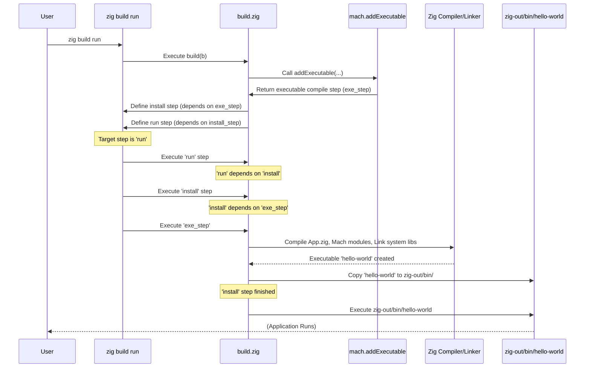

# Chapter 10: Build System

> (`build.zig`) — *Mach Engine 0.4*

> ***CAUTION**:* *THIS TUTORIAL WAS AI-GENERATED AND MAY CONTAIN ERRORS. IT IS **NOT** AFFILIATED WITH OR ENDORSED BY HEXOPS/MACH.*

In [Chapter 9: Math Library](09_mach_math_.md), we explored the mathematical tools Mach provides for working with geometry. We've seen how to create windows, manage data, define systems, organize modules, draw graphics, write shaders, and handle audio and math. But how do all these pieces actually get compiled and linked together into a runnable application? How do we manage external code (dependencies) like Mach itself?

## The Construction Manager: `build.zig`

Imagine you're building a complex model kit. You have instructions, different sprues of parts (like the engine, the chassis, the body), and maybe some extra parts you bought separately (like custom wheels). You need a plan to assemble everything correctly, ensuring the right parts are used and connected properly.

In the world of Zig and Mach, the `build.zig` file is that **master instruction plan**, and the `zig build` command is the tool that follows the plan. The `build.zig` script acts like the **construction manager** for your entire project.

Its main responsibilities are:

1.  **Compiling Code:** Telling the Zig compiler which `.zig` files (like your `src/App.zig`) need to be compiled.
2.  **Managing Dependencies:** Finding and including other code libraries your project needs, like the Mach engine itself, which is declared in a related file called `build.zig.zon` (covered in [Chapter 11: Dependency Management](11_dependency_management_.md)).
3.  **Linking Parts:** Ensuring that your compiled code can correctly call functions from Mach (like `core.windows.new` or `sprite.objects.new`) and that Mach can interact with the operating system's graphics and audio libraries.
4.  **Configuring the Build:** Allowing you to specify options like:
    *   **Optimization:** Should the code be fast (`ReleaseFast`) or easy to debug (`Debug`)?
    *   **Target Platform:** Are you building for Windows, macOS, Linux, or WebAssembly? (e.g., `zig build -Dtarget=x86_64-windows-gnu`)
    *   **Engine Features:** Selecting specific graphics or audio backends if needed (though often handled automatically).
5.  **Handling Assets:** Processing non-code files, like compiling WGSL shaders ([Chapter 6: Shaders (WGSL)](06_shaders_wgsl_.md)) into a format the engine can use.

Without `build.zig`, the Zig compiler wouldn't know how to assemble your Mach application from all its constituent parts.

## Key Concepts

Let's break down the essential ideas:

*   **`build.zig`:** A file written in Zig itself that defines build logic using the Zig build system API. It contains a `pub fn build(b: *std.Build)` function.
*   **`zig build <step>`:** The command-line tool you use to execute the logic in `build.zig`. Common `<step>` arguments include:
    *   (no step): Usually builds the main executable.
    *   `run`: Builds *and* runs the main executable.
    *   `test`: Builds and runs any tests defined in your code or build script.
    *   `install`: Copies the built artifacts (like the executable) to a standard location (`zig-out`).
*   **Builder (`b: *std.Build`)**: An object passed to your `build` function that provides methods for defining build steps, adding modules, creating executables, managing dependencies, etc.
*   **Module:** A unit of Zig code (often defined by a root `.zig` file) that can be compiled and potentially imported by other modules. Both your application (`App.zig`) and Mach itself are treated as modules by the build system.
*   **Dependency:** Another Zig project (like Mach) that your project relies on. Declared in `build.zig.zon` and accessed in `build.zig` using `b.dependency(...)`.
*   **Artifact:** A result of the build process, such as an executable (`.exe`), static library (`.a`), or dynamic library (`.dll`, `.so`, `.dylib`).
*   **Step:** An action in the build process, like compiling code, running tests, or installing artifacts. Steps can depend on other steps.

## Putting `build.zig` to Work: The "Getting Started" Example

Let's look at the simple `build.zig` from the "[Getting Started](https://machengine.org/docs/getting-started/)" guide and understand its parts.

```zig
// build.zig (from Getting Started)
const std = @import("std");

pub fn build(b: *std.Build) void {
    // --- Configuration ---
    // Get standard target (OS, architecture) options from the command line
    const target = b.standardTargetOptions(.{});
    // Get standard optimization level options (Debug, ReleaseSafe, ReleaseFast, etc.)
    const optimize = b.standardOptimizeOption(.{});
    // --- End Configuration ---

    // --- Define Your Application Module ---
    // Tell the build system about your application code.
    const app_mod = b.addModule("my_app", .{ // Give it a name ("my_app")
        .root_source_file = b.path("src/App.zig"), // Entry point file
        .target = target,
        .optimize = optimize,
    });
    // --- End Application Module ---

    // --- Add Mach Dependency ---
    // Get the Mach dependency (defined in build.zig.zon)
    const mach_dep = b.dependency("mach", .{
        .target = target,
        .optimize = optimize,
    });
    // Make Mach available to your app code via ` @import("mach") `
    app_mod.addImport("mach", mach_dep.module("mach"));
    // --- End Mach Dependency ---

    // --- Create the Executable using Mach's Helper ---
    // Use a helper function provided by Mach's build script
    const exe = @import("mach").addExecutable(mach_dep.builder, .{
        .name = "hello-world", // Name of the output executable
        .app = app_mod,        // Your application module
        .target = target,
        .optimize = optimize,
    });
    // Add a step to install the executable (e.g., to zig-out/bin)
    b.installArtifact(exe);
    // --- End Create Executable ---

    // --- Define the 'run' Step ---
    // Create a command to run the executable we just built
    const run_cmd = b.addRunArtifact(exe);
    // Make 'run' depend on the installation step first
    run_cmd.step.dependOn(b.getInstallStep());
    // Pass any arguments from `zig build run -- arg1 arg2` to the app
    if (b.args) |args| { run_cmd.addArgs(args); }
    // Create the actual 'run' step accessible via `zig build run`
    const run_step = b.step("run", "Run the app");
    run_step.dependOn(&run_cmd.step);
    // --- End 'run' Step ---

    // (Test step omitted for brevity, see full Getting Started example)
}

```

Let's break this down:

1.  **Configuration (`target`, `optimize`):** These lines read options passed on the command line (like `-Dtarget=...` or `-Doptimize=ReleaseFast`) and store them for later use.
2.  **Application Module (`app_mod`):** `b.addModule` tells the build system about your project's code. You give it a name (used internally) and specify the main file (`src/App.zig`).
3.  **Mach Dependency (`mach_dep`):** `b.dependency("mach", ...)` fetches the Mach engine dependency (details in [Chapter 11](11_dependency_management_.md)). `app_mod.addImport("mach", ...)` makes it so that when your `App.zig` code says `@import("mach")`, the compiler knows where to find the Mach module code.
4.  **Create Executable (`exe`):** Instead of manually setting up the executable, linking system libraries, etc., we use a helper function `@import("mach").addExecutable` provided by Mach's *own* `build.zig` file. This function takes care of:
    *   Creating the executable artifact.
    *   Setting up the correct entry point (often `src/entrypoint/main.zig` within Mach).
    *   Automatically linking necessary system libraries for graphics (`mach.sysgpu`) and windowing (`mach.Core`) based on the target platform.
    *   Including necessary assets like the Windows manifest file.
    *   `b.installArtifact(exe)` creates a build step that copies the final executable to the output directory (usually `zig-out/bin`).
5.  **'run' Step:** This defines what happens when you type `zig build run`.
    *   `b.addRunArtifact(exe)` creates a command that will execute the compiled `exe`.
    *   `run_cmd.step.dependOn(b.getInstallStep())` ensures the executable is built and installed *before* trying to run it.
    *   `b.step("run", ...)` makes the step available on the command line.

**Common Commands:**

*   `zig build`: Compiles `hello-world` and installs it to `zig-out/bin/hello-world`.
*   `zig build run`: Compiles `hello-world`, installs it, and then runs `zig-out/bin/hello-world`.
*   `zig build -Dtarget=aarch64-macos run`: Cross-compiles for Apple Silicon macOS, installs, and (if you're on macOS) runs it.
*   `zig build -Doptimize=ReleaseFast`: Builds an optimized version for speed.

**Handling Shaders:**

How do WGSL shaders get included? Mach's `build.zig` often provides helpers for this too, like `mach.generateShaders` (used in the main Mach `build.zig`, see context).

```zig
    // In a more complex build.zig (or internally within mach.addExecutable)
    // you might see something like this:

    // Assume 'exe' is the executable artifact from b.addExecutable
    try mach.generateShaders(exe, .{
        // Key is the module name needing the shader (e.g., 'app')
        // Value is a list of .wgsl files for that module
       .app = &.{ "src/shader.wgsl" },
    });
```

This helper function would:
1.  Find the specified `.wgsl` files.
2.  Compile them (potentially using tools mentioned in [Chapter 6](06_shaders_wgsl_.md)).
3.  Embed the compiled shader code directly into the `exe` artifact.
4.  Make the embedded shader data available to the corresponding runtime module (e.g., `app`) so it can be loaded by [`mach.gpu`](07_mach_sysgpu_.md) via functions like `device.createShaderModuleWGSL(...)`.

## Under the Hood: Following the Build Plan

What happens conceptually when you run `zig build run` using the script above?

1.  **Execute `build.zig`:** Zig runs your `build.zig` script.
2.  **Parse Options:** The script reads command-line options (`target`, `optimize`).
3.  **Define Modules:** It defines the `app_mod` and gets the `mach_dep`.
4.  **Setup Executable:** It calls `@import("mach").addExecutable`. Mach's helper function sets up the executable compilation step, including specifying source files, linking Mach modules, and linking necessary system libraries (like Metal framework on macOS, or Vulkan/X11 libs on Linux, or DirectX/WinAPI libs on Windows).
5.  **Define Steps:** It defines the `install` step for the executable and the `run` step that depends on `install`.
6.  **Execute Target Step (`run`):** Since you asked for `run`, the build system executes that step.
7.  **Dependency Execution:** The `run` step depends on `install`, so the `install` step runs first.
8.  **Compilation/Linking:** The `install` step depends on the `exe` compilation step. The Zig compiler compiles `App.zig`, Mach's modules, and links them with system libraries, producing `hello-world`.
9.  **Installation:** The `install` step copies `hello-world` to `zig-out/bin/`.
10. **Execution:** The `run` step finally executes `zig-out/bin/hello-world`.

**Simplified Sequence Diagram (`zig build run`):**



**Code Glance (Key Build Functions):**

*   **`build.zig` (Your Project):**
    *   `b.standardTargetOptions()`: Reads `-Dtarget=...` etc.
    *   `b.standardOptimizeOption()`: Reads `-Doptimize=...` etc.
    *   `b.addModule("name", options)`: Defines a Zig code module.
    *   `b.dependency("dep_name", options)`: Gets a dependency defined in `build.zig.zon`.
    *   `module.addImport("import_name", dependency_module)`: Makes one module available to another via `@import`.
    *   `b.addExecutable(options)`: Creates a step to compile an executable artifact.
    *   `b.addRunArtifact(artifact)`: Creates a step to run a compiled artifact.
    *   `b.installArtifact(artifact)`: Creates a step to copy an artifact to the output directory.
    *   `step.dependOn(other_step)`: Defines execution order.
*   **`build.zig` (Mach Project - provides helpers):**
    *   `mach.addExecutable(...)`: (As seen above) Simplifies creating a standard Mach application executable, handling entry points and linking.
    *   `mach.generateShaders(...)`: (As seen above) Handles compiling and embedding WGSL shaders.
    *   `linkCore(b, module)`, `linkSysgpu(b, module)`, `linkSysaudio(b, module)`: Internal helpers (used by `addExecutable`) that add the necessary `linkSystemLibrary` or `linkFramework` calls for different platforms. For example, `linkSysgpu` might add `-lMetal -framework CoreGraphics` on macOS, or `-ldxgi -ld3d12` on Windows.

These functions abstract away many platform-specific details, letting you focus on defining your application structure.

## Conclusion

You've learned about the crucial role of the `build.zig` file and the Zig build system in constructing your Mach application. It acts as the project's construction manager, defining how your code and dependencies like Mach are compiled, configured, and linked together. We explored the key concepts like modules, dependencies, artifacts, and steps, and dissected a basic `build.zig` file to see how it uses standard Zig build functions and helpers provided by Mach (like `addExecutable`) to create a runnable application.

The build system relies heavily on knowing *what* dependencies your project needs. How are these dependencies declared and managed? That's the focus of the next chapter.

Let's move on to [Chapter 11: Dependency Management](11_dependency_management_.md).

---

Generated by [AI Codebase Knowledge Builder](https://github.com/mnbnkr/Tutorial-Codebase-Knowledge)
