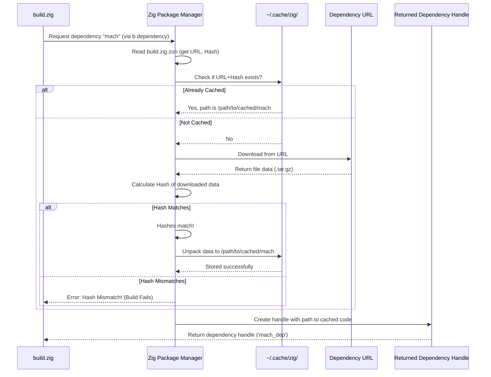

# Chapter 11: Dependency Management

> (`build.zig.zon`)

> ***CAUTION**:* *THIS TUTORIAL WAS AI-GENERATED AND MAY CONTAIN ERRORS. IT IS **NOT** AFFILIATED WITH OR ENDORSED BY HEXOPS/MACH.*

In [Chapter 10: Build System](10_build_system_.md), we saw how the `build.zig` file acts as the construction manager for our project, telling the Zig compiler how to assemble our application. We learned that it uses a helper function like `mach.addExecutable` and refers to dependencies like Mach itself using `b.dependency("mach", ...)`.

But how does `build.zig` know *where* to find the Mach engine code or other external libraries? How does it ensure we get the correct version and that the code hasn't been tampered with? This is where **dependency management** and the `build.zig.zon` file come into play.

## Your Project's Shopping List

Imagine you're baking a cake (your application). You have your recipe (`build.zig`), but you need ingredients that you don't have in your kitchen (like flour, sugar, eggs – or in our case, the Mach engine code, maybe an image loading library, etc.). You need a shopping list!

The `build.zig.zon` file is exactly that: your project's **shopping list**. It tells the Zig build system (our "shopping assistant"):

1.  **What ingredients (dependencies) you need:** e.g., "mach", "zigimg".
2.  **Where to get them:** A specific download URL (the "store address").
3.  **How to verify them:** A unique content hash (like a "quality seal" or barcode) to make sure you got exactly what you expected.

This system ensures your project can reliably find and use external code libraries.

## Key Concepts

Let's unpack the core ideas:

*   **Dependency:** A piece of external code (another Zig project or library) that your project needs to function. Mach itself is the primary dependency for a Mach application.
*   **Zig Package Manager:** The built-in system within Zig's build tools that reads `build.zig.zon`, downloads dependencies, verifies them, and makes them available to your `build.zig` script.
*   **`build.zig.zon`:** The manifest file (the "shopping list"). It's written in a simple `.zon` (Zig Object Notation) format. It lists all top-level dependencies.
*   **URL:** The web address where the package manager can download the dependency's source code (usually a compressed archive like `.tar.gz`).
*   **Hash:** A cryptographic checksum (typically SHA-256) of the downloaded file's content. The package manager calculates the hash of the downloaded file and compares it to the hash listed in `build.zig.zon`. If they don't match, the build fails, preventing accidental use of incorrect or malicious code.
*   **`lazy = true`:** An optional flag for a dependency in `build.zig.zon`. If set, the package manager will *only* download and verify this dependency if the `build.zig` script *actually requests it* (usually via `b.lazyDependency(...)` or conditionally calling `b.dependency(...)`). This saves time and bandwidth if certain dependencies are only needed for specific build configurations or features.

## Putting `build.zig.zon` to Work

Let's look at the `build.zig.zon` file from Mach itself (which your project's `build.zig.zon` would typically reference).

**1. The `build.zig.zon` File Structure**

```zig
// build.zig.zon (Simplified Example from Mach)
.{
    // Name of this package
    .name = "mach",
    // Version of this package
    .version = "0.4.0", // Or current version

    // List of files/directories included in this package itself
    .paths = .{
        "src",
        "build.zig",
        "build.zig.zon",
        // ... other files like LICENSE, README ...
    },

    // --- The Dependencies List ---
    .dependencies = .{
        // --- Example: A Core Dependency (Maybe for Fonts) ---
        .mach_freetype = .{
            // Where to download it from
            .url = "https://pkg.machengine.org/mach-freetype/...",
            // The expected content hash
            .hash = "1220adfccce3dbc4e4fa...",
            // Download only if requested by build.zig
            .lazy = true,
        },

        // --- Example: A Platform-Specific Dependency (macOS) ---
        .mach_objc = .{
            .url = "https://pkg.machengine.org/mach-objc/...",
            .hash = "12203675829014e69b...",
            .lazy = true,
        },

        // --- Example: A Dependency for Examples Only ---
        .zigimg = .{
            .url = "https://github.com/zigimg/zigimg/archive/....tar.gz",
            .hash = "12201b874ac217853e...",
            .lazy = true,
        },

        // ... many other dependencies for different features/platforms ...
    },
}

```

*   `.name`, `.version`, `.paths`: Describe the package defined by *this* `build.zig.zon` file.
*   `.dependencies`: This is the crucial part – an anonymous struct where each field represents a dependency.
    *   The field name (`.mach_freetype`, `.mach_objc`, `.zigimg`) is the **name** you use to refer to this dependency in your `build.zig` script (e.g., `b.dependency("mach_freetype", ...)`).
    *   `.url`: Specifies the download location.
    *   `.hash`: Provides the SHA-256 hash for verification.
    *   `.lazy = true`: Indicates this dependency might not always be needed.

**2. How `build.zig` Uses It**

In your project's `build.zig`, when you call `b.dependency()`, the Zig package manager springs into action.

```zig
// build.zig (Snippet from Chapter 10)

// Get the Mach dependency (defined in build.zig.zon)
const mach_dep = b.dependency("mach", .{ // <-- Asks for "mach"
    .target = target,
    .optimize = optimize,
    // Optional: Request specific sub-features if Mach's build.zig supports it
    // .core = true,
    // .sysaudio = true,
});
```

*   `b.dependency("mach", ...)` tells the package manager: "I need the dependency named 'mach' as defined in `build.zig.zon`."
*   The package manager finds the `.mach = .{ ... }` entry in `build.zig.zon`, checks its cache, downloads if necessary, verifies the hash, and then makes the dependency's code (and its own `build.zig` file!) available to your script via the `mach_dep` object.

**3. Lazy Dependencies**

Mach's own `build.zig` often uses `b.lazyDependency` to avoid fetching things unless absolutely required. For example, it might only fetch the `mach_objc` dependency if the target platform is macOS.

```zig
// Mach's build.zig (Conceptual Example)

// Check if the target is macOS
if (target.result.isDarwin()) {
    // Only try to get the 'mach_objc' dependency if we are on macOS
    if (b.lazyDependency("mach_objc", .{ // <-- Asks lazily
        .target = target,
        .optimize = optimize,
    })) |dep| {
        // If successful (downloaded & verified), make it available
        module.addImport("objc", dep.module("mach-objc"));
    }
}
```

*   `b.lazyDependency("mach_objc", ...)` checks if the dependency is needed *and* requested. If both are true, it behaves like `b.dependency()`. If the dependency is not needed or not requested by the user (`lazy = true` in `.zon`), it might return `null` or skip the download/verification step.

**4. Adding/Updating Dependencies (`zig fetch`)**

How do entries get into `build.zig.zon` in the first place? While you can edit it manually, Zig provides a command:

```bash
# Example: Add mach as a dependency to your project
zig fetch --save https://pkg.machengine.org/mach/LATEST_COMMIT_HASH.tar.gz

# Example: Add zigimg as a dependency named 'zigimg'
zig fetch --save --name zigimg https://github.com/zigimg/zigimg/archive/COMMIT_HASH.tar.gz
```

*   `zig fetch --save <URL>`: Downloads the code from the URL, calculates its hash, and automatically adds or updates the corresponding entry in your `build.zig.zon` file. The dependency name will be inferred from the URL or you can specify it with `--name`. This is the recommended way to manage dependencies.

## Under the Hood: The Package Manager's Workflow

What happens when `zig build` encounters a `b.dependency("mach", ...)` call?

**High-Level Walkthrough:**

1.  **Request:** The `build.zig` script requests the dependency named "mach".
2.  **Manifest Lookup:** The Zig package manager reads the current project's `build.zig.zon` file and finds the entry for `.mach`. It gets the URL and expected hash.
3.  **Cache Check:** It checks a global cache directory on your computer (often `~/.cache/zig/`) to see if a package matching that URL *and* hash has already been downloaded and verified.
4.  **Download (if needed):** If not found in the cache, it downloads the `.tar.gz` file from the specified URL.
5.  **Verification:** It calculates the SHA-256 hash of the *downloaded* file.
6.  **Hash Comparison:** It compares the calculated hash with the `.hash` value listed in `build.zig.zon`.
    *   **Match:** Success! The downloaded code is correct. It unpacks the code into the cache.
    *   **Mismatch:** Error! The build fails immediately with a hash mismatch error. This protects you from corrupted downloads or unexpected changes.
7.  **Provide Access:** The package manager makes the path to the verified, unpacked code in the cache available to the `build.zig` script (inside the `mach_dep` object in our example). The script can then access the dependency's source code (`mach_dep.module("mach")`) and its own `build.zig` file (`mach_dep.builder`).

*(For `lazy = true` dependencies requested via `b.lazyDependency`, steps 4-7 might be skipped if the dependency isn't actually required for the current build configuration).*

**Sequence Diagram (`b.dependency("mach", ...)` Flow):**



This careful process of downloading, hashing, and caching ensures that your builds are reproducible and secure. Once a dependency version is cached, subsequent builds using the same version are much faster as they don't need to download it again.

**Code Glance:**

*   **`build.zig.zon`:** (Already shown above) Defines the list of dependencies, their URLs, and hashes. The structure is key.
*   **`build.zig`:** Uses the `b.dependency` or `b.lazyDependency` functions provided by the `std.Build` API.

    ```zig
    // build.zig (Relevant functions)
    const mach_dep = b.dependency("mach", .{...}); // Standard request
    const freetype_dep = b.lazyDependency("mach_freetype", .{...}); // Lazy request

    // Accessing the dependency's code module
    const mach_module = mach_dep.module("mach");
    app_mod.addImport("mach", mach_module);

    // Accessing the dependency's own build.zig (if needed, e.g., for helpers)
    const mach_builder = mach_dep.builder;
    // @import("mach") within build.zig refers to the dependency's build.zig
    const exe = @import("mach").addExecutable(mach_builder, .{...});
    ```

## Conclusion

Congratulations on reaching the end of this tutorial series! In this final chapter, you've learned about dependency management in Zig and Mach using the `build.zig.zon` file. This file acts as your project's "shopping list," specifying external dependencies, their download URLs, and content hashes for verification. The Zig package manager uses this file, along with calls like `b.dependency` in your `build.zig` script, to automatically download, verify, and cache these dependencies, ensuring your builds are reliable and reproducible. The `lazy = true` option helps optimize builds by only fetching dependencies when they are actively needed.

Understanding `build.zig.zon` completes the picture of how a Mach project is structured, built, and connected to its required libraries. You now have a foundational understanding of Mach's core concepts, from windowing and object management to graphics, audio, math, and the build process.

We encourage you to explore the examples in the Mach repository, experiment with the concepts you've learned, and join the [Mach Discord community](https://machengine.org/discord) if you have questions or want to share your projects. Happy coding!

---

Generated by [AI Codebase Knowledge Builder](https://github.com/mnbnkr/Tutorial-Codebase-Knowledge)
