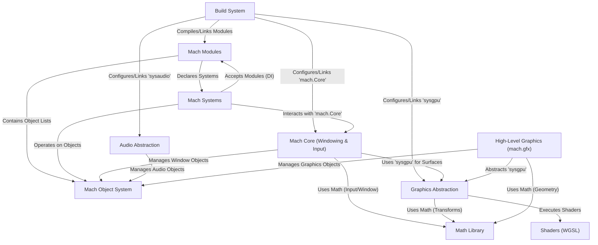

# Overview: Mach Engine (0.4)

> ***CAUTION**:* *THIS TUTORIAL WAS AI-GENERATED AND MAY CONTAIN ERRORS. IT IS **NOT** AFFILIATED WITH OR ENDORSED BY HEXOPS/MACH.*

Mach is a **modular** game engine and graphics toolkit written in *Zig*. It helps developers create games and graphical applications by providing building blocks for common tasks. Key features include its own **object system** (an alternative to ECS), abstractions for *graphics* (`mach.gpu`/`mach.gfx`), *audio* (`mach.Audio`), and *windowing/input* (`mach.Core`), along with a math library (`mach.math`) and a build system that manages dependencies and compilation.

**Source Repository:** [hexops/mach](https://github.com/hexops/mach)

## Chapters

1. [Mach Core (Windowing & Input)](01_mach_core_.md)
2. [Mach Object System (`mach.Objects`, `ObjectID`)](02_mach_object_system_.md)
3. [Mach Systems (`mach_systems`, `mach.schedule`)](03_mach_systems_.md)
4. [Mach Modules (`mach.Modules`)](04_mach_modules_.md)
5. [High-Level Graphics (`mach.gfx`)](05_mach_gfx_.md)
6. [Shaders (WGSL)](06_shaders_wgsl_.md)
7. [Graphics Abstraction (`mach.sysgpu` / `mach.gpu`)](07_mach_sysgpu_.md)
8. [Audio Abstraction (`mach.sysaudio` / `mach.Audio`)](08_mach_sysaudio_.md)
9. [Math Library (`mach.math`)](09_mach_math_.md)
10. [Build System (`build.zig`)](10_build_system_.md)
11. [Dependency Management (`build.zig.zon`)](11_dependency_management_.md)

---

Generated by [AI Codebase Knowledge Builder](https://github.com/mnbnkr/Tutorial-Codebase-Knowledge)
